# Introduction

## Motivation

## Research Objectives

# Related work

This chapter reviews computational methods for drug-target interaction
prediction. Section 2.1 outlines the field's evolution from docking to
deep learning. Sections 2.2--2.4 describe the main data modalities:
SMILES, protein sequences, gene expression profiles, and physicochemical
descriptors. Section 2.5 surveys representative model architectures, and
Section 2.6 introduces the cold-start evaluation protocol.

## Evolution of DTI Prediction Methods

The prediction of drug-target interactions (DTI) has evolved from
laborious in vitro experiments to computational methods, initially
dominated by structure-based approaches such as molecular docking
[@fan2019progress]. Various docking techniques have been established,
including Gold [@verdonk2003improved] and DOCK [@lang2009dock]. However,
these methods are frequently constrained by the limited availability of
high-resolution 3D structures and substantial computational overhead.
Consequently, the field has shifted toward chemogenomic approaches,
leveraging machine learning and, more recently, deep learning
[@chen2024drug].

## Structural and Sequence-Based Representations

Most deep learning models treat DTI as a unimodal or bimodal task, where
the primary modalities are the 1D compound structure and the 1D protein
sequence. The Simplified Molecular Input Line Entry System (SMILES)
[@weininger1988smiles], introduced by David Weininger, is a rigorous
chemical notation system rooted in molecular graph theory. It encodes a
molecular graph into a linear string using a grammar consisting of
atomic symbols and bond identifiers (e.g., \"-\" for single bonds, \"=\"
for double bonds), parentheses for branching, and digits to denote ring
closures. This representation effectively flattens the 3-dimensional
compound structure into a 1-dimensional format while retaining essential
valence information.

Complementary to the chemical representation, protein targets are
predominantly represented as sequences where each element corresponds to
one of the 20 standard amino acids. While these 1D representations focus
on the intrinsic properties of molecules and proteins, they often fail
to capture the dynamic functional impact of their interactions in a
complex biological environment.

## Functional Modalities and Transcriptional Signatures

Beyond structural descriptors, an increasingly prominent modality in DTI
prediction involves the use of high-throughput biological response data.
A significant advancement in this area is provided by the Library of
Integrated Network-Based Cellular Signatures (LINCS) L1000
program[@chen2024drug], which has systematically generated approximately
1.3 million gene expression profiles. Unlike traditional methods, the
L1000 dataset represents biological activity through \"gene
signatures\"-large-scale profiles characterizing the transcriptional
response of human cell lines to various pharmacological and genomic
perturbations. This approach operates on the principle that if a
compound and a genomic modulation, such as shRNA or cDNA, target the
same protein, they should induce correlated changes in downstream gene
expression

## Physicochemical Metadata and Clinical Pharmacological Profiles

The fourth modality encompasses drug metadata, which is frequently
defined in the literature as physicochemical molecular descriptors or
pharmacological profiles. While structure-based representations, such as
SMILES, focus on local chemical patterns, metadata allows for capturing
the global properties of a molecule that determine its behavior within a
biological system.

The MIFAM-DTI model [@li2024mifam] utilizes a physicochemical property
feature vector for this purpose, consisting of 202 parameters calculated
using the RDKit library [@landrum2024rdkit]. This vector includes key
characteristics such as molecular weight, solubility, lipophilicity,
polarity, and molecular stability. These features provide essential
information regarding the drug's ability to cross biological barriers
and its overall pharmacokinetics.

## Computational Models for Drug-Target Interaction Prediction

The data modalities described in the previous sections (1D structural
strings, transcriptomic signatures, and physicochemical metadata) form a
heterogeneous information space. To leverage these multi-source inputs,
the field has transitioned toward deep learning architectures capable of
high-level feature extraction and information fusion.

#### TransformerCPI

Modern frameworks often employ attention mechanisms to autonomously
learn the relative importance of different features. A fundamental
scheme in the literature involves using drugs in SMILES format and
proteins as one-dimensional sequences. These models often utilize
multiple data transformations to extract as much information as
possible. A common baseline model frequently used for comparison with
recent architectures is TransformerCPI [@chen2020transformercpi]. Like
most modern models, it utilizes 1D protein sequences and drug
representations in SMILES format. The authors employ a 3-gram method to
create \"words\" consisting of three amino acids, and subsequently,
inspired by the word2vec technique [@mikolov2013efficient], they
generate 100-dimensional vectors. These vectors are processed using
one-dimensional convolutional neural networks (Conv1D), which are
designed to learn and capture local patterns within the sequence, as
well as Gated Linear Units (GLU). Simultaneously, drug molecules are
converted into graphs-where each atom is represented by a 34-dimensional
feature vector-using the RDKit library [@landrum2024rdkit]. These graphs
serve as input for Graph Convolutional Networks (GCN) [@zhang2019graph],
which map the drug's structure and the bonds between atoms to extract
the molecule's local features. The core of the architecture is a decoder
with a self-attention mechanism that integrates features from both
proteins and drugs to identify potential interactions. The final
component is a dense neural network that aggregates the data to produce
the ultimate prediction score.

#### MFD-GDrug

While TransformerCPI established a solid foundation by utilizing a
self-attention mechanism to identify interactions, more recent
architectures, such as MFD-GDrug [@gu2024mfd], introduce significant
improvements in data representation. A key limitation of the
TransformerCPI model is its reliance on simple 3-gram protein
embeddings, which may not fully capture the complex biological functions
of proteins. MFD-GDrug addresses this issue by employing multimodal
feature fusion and leveraging the Evolutionary Scale Modeling (ESM)
pretrained model[@lin2023evolutionary]. Unlike traditional approaches,
the ESM model provides a much richer representation of proteins . To
complement the ESM model, MFD-GDrug uses Conv1D neural networks to
capture local features of proteins. Similar to TransformerCPI, MFD-GDrug
uses Graph Convolutional Networks to capture local features of
molecules. The model derives three-dimensional compound features from
the Mol2Vec[@jaeger2018mol2vec] layer. By combining this, MFD-GDrug
achieves superior predictive performance, particularly for challenging
targets such as G protein-coupled receptors (GPCRs).

The authors of MFD-GDrug also conducted ablation experiments to evaluate
the impact of removing specific components from the model's
architecture. Removing the Mol2Vec module and the ESM2 network resulted
in only a slight decrease in prediction accuracy. However, the exclusion
of the GCN (for drug features) or the convolutional networks (for
protein features) led to a significant drop in performance, decreasing
the accuracy by as much as 18 percentage points in certain tests. These
results suggest that local features of proteins and drugs are more
critical for successful prediction than global dependencies (at least
for the GPCR targets studied by MFD-GDrug). It should be noted, however,
that ablation (removing a module from a jointly trained model) is not
the same as comparing standalone encoders since the remaining components
may compensate for the removed one.

#### MCL-DTI

A slightly different approach was applied in the MCL-DTI [@qian2023mcl]
model. Instead of converting the drug into a graph and using graph
convolutional networks, the authors decided to generate a molecular
image and additional physicochemical features such as acceptors, donors,
hydrogen bonds, and aromaticity. Proteins are processed in a manner very
similar to the TransformerCPI model, meaning that feature vectors are
created using the k-gram method. The researchers focused on advanced
attention mechanisms. Both protein and drug feature vectors are trained
in blocks with a self-attention mechanism. Subsequently, the newly
trained dependencies are combined and trained in a block with a
cross-attention mechanism. The resulting features are passed through
another block consisting of a normalization layer, a self-attention
block, another normalization layer, and a dense neural network. The
results are promising, outperforming those presented by TransformerCPI
and are comparable to MFD-GDRUG. The researchers also conducted ablation
experiments, which show that simplifying the network by removing the
attention mechanisms causes only a slight decrease in model accuracy.
This may suggest that feature engineering itself is more important than
advanced model architecture.

#### Models benchmark

The authors of the \"Benchmark on Drug Target Interaction Modeling from
a Drug Structure Perspective\" [@zhang2024benchmark] presented a very
interesting perspective on DTI. They compared eight models for
classification and regression tasks using the following pairs:

  Model   Protein Representation   Drug Representation
  ------- ------------------------ ----------------------
  1       Label Encoding           Graph Neural Network
  2       N-gram                   Graph Neural Network
  3       ESM2                     Graph Neural Network
  4       Transformer              Graph Neural Network
  5       Label Encoding           Transformer
  6       N-gram                   Transformer
  7       ESM2                     Transformer
  8       Transformer              Transformer

Based on the experiments, they reached the following conclusions:

- GNNs perform better than Transformers in regression tasks but are less
  effective in classification.

- ESM2 performed better than ordinary protein encoding, which is
  somewhat contradictory to the findings of MFD-GDrug, where local
  features were shown to be more important than global ones.

The authors also examined whether adding specific chemical features
would improve the predictive capabilities of the models. They tested
several combinations:

- Atom Properties (AP): such as atom type, degree, and valence.

- Hydrogen Information (HI): such as the total number of hydrogens.

- Stereochemistry (Ste): such as chirality.

- Electronic Properties (EP): such as atom charge, hybridization, and
  lone pairs.

- Structural Information (Str): such as bond angles and bond lengths.

The research showed that more features do not always lead to better
predictions. Specifically, AP, HI, and Ste improved the results, while
EP and Str worsened the performance. Based on these findings, they
constructed their own model:

- For proteins: an Embedding Layer and a multilayer CNN.

- For drugs: a Graph with an attention mechanism and an Embedding Layer
  with a CNN.

The authors emphasize the high accuracy of this model, as well as the
low time and memory resources required for its training.

### DTIGCCN

While the majority of the aforementioned models heavily rely on static
sequence and structural representations, other approaches attempt to
leverage biological domain knowledge, such as transcriptomic profiling.
A notable example in this area is the DTIGCCN architecture
[@shao2020dtigccn]. Instead of representing drugs as 2D molecular graphs
and proteins as 1D sequences, DTIGCCN extracts features directly from
the drug and target expression profiles (specifically, 978-dimensional
vectors from the LINCS L1000 database). The core innovation of DTIGCCN
lies in dynamically constructing a fully connected gene-gene graph for
both the drug and the target. In these graphs, each of the 978 landmark
genes is treated as a separate node, and the edge weights are computed
dynamically using a Gaussian kernel function over the distances between
the gene expression values.

To process these dense graphs, the authors employ a spectral-based Graph
Convolutional Network. The graph is first coarsened using the Graclus
multi-level clustering algorithm and rearranged into a balanced binary
tree, which allows for efficient 1D pooling operations. Simultaneously,
to capture the latent relationship between the drug and target, their
expression profiles are concatenated into a $2 \times 978$ matrix and
processed through a Convolutional Neural Network (CNN). Finally, the
features extracted independently by the GCN and jointly by the CNN are
fused and passed to a classifier. This methodology demonstrates that
treating transcriptomic data as a dynamic graph structure can
successfully capture complex biological relationships that static
chemical descriptors might miss.

## Cold start problem

The *cold-start problem* in DTI refers to an evaluation protocol in
which the test set contains drugs (unseen-drug), proteins
(unseen-target), or both (unseen-both) that are entirely absent from the
training set. Under such conditions, models that have memorized
per-entity statistics fail to generalize, and performance typically
degrades compared to standard random or scaffold-based splits.
Consequently, the ability to generalize in cold-start scenarios has
become a primary metric for evaluating DTI models.

#### DTIAM

The DTIAM [@lu2025dtiam] model addresses this issue by employing
self-supervised pre-training instead of traditional supervised learning.
In comparison to supervised models such as MCL-DTI and MFD-GDrug, the
DTIAM has two training phases:

- The first phase is called self-supervised pre-training, which does not
  require labels in datasets. The architecture of the model includes 2
  parallel instances that work in a similar way. On one hand, the drug
  representation (SMILES) is converted into a graph and divided into
  substructures. Subsequently, the Transformer Encoder learns the hidden
  patterns within those substructures with the help of autonomous
  pre-training tasks:

  - Masked Language Modeling (MLM) forces the model to predict hidden
    tokens, thereby learning the chemical and biological contexts.

  - Molecular Descriptor Prediction focuses on learning the global
    physicochemical properties of the drug.

  - Molecular Functional Group Prediction enables the model to identify
    specific functional groups within the molecule.

  The output of the neural network consists of trained embeddings that
  represent knowledge of the compound's properties. On the other hand,
  protein sequences are processed into individual residues. Another
  transformer based on ESM-2 learns protein properties with the help of
  two autonomous tasks:

  - Masked Language Modeling (MLM)

  - ContactPred focuses on learning protein contacts, defined as pairs
    of amino acid residues that are spatially close in three-dimensional
    space, despite being distant in the primary sequence.

  This part of the model also creates embeddings that represent the
  protein's properties.

- The second phase is supervised learning. A downstream drug-target
  prediction module receives drug and protein embeddings as input and
  produces the final interaction prediction.

Authors of DTIAM models emphasize the model's ability to generalize the
DTI problem, especially in cold-start scenarios. Furthermore, the DTIAM
model can be learned on a very small portion of the dataset compared to
\"traditional\" models like MFD-Drug: with only 20% of samples, DTIAM
can outperform models learned on 80% of the same dataset, which is
crucial due to the clean data shortage (very often, the data lacks the
majority of interactions within the dataset).

#### Knowledge-Enhanced Protein Ligand binding Affinity prediction (KEPLA)

The KEPLA model [@liu2025kepla] takes a distinct approach by integrating
domain-specific biochemical knowledge directly into the deep learning
architecture. In contrast to models relying only on patterns from
sequences and graphs, KEPLA employs a joint training framework that
simultaneously optimizes two complementary objectives: Knowledge Graph
embedding and binding affinity prediction. The architecture consists of
the following components:

- Structural Encoding: Similarly to DTIAM, KEPLA utilizes separate
  encoders for each modality. For proteins, it uses the pre-trained
  ESM-2 model to extract patterns from amino-acid sequences. For drugs,
  instead of a Transformer, it utilizes Graph Convolutional Networks to
  process molecular graphs transformed from SMILES, capturing
  topological information.

- Knowledge Graph Embedding Objective: To enhance the structural
  representations, the model aligns the global embeddings of drugs and
  targets with a constructed Knowledge Graph containing biochemical
  facts:

  - For proteins, the model incorporates Gene Ontology annotations,
    including molecular functions and biological processes.

  - For ligands, it integrates Ligand Properties, such as molecular
    descriptors and chemical features.

  The model uses translation-based methods to learn the relationships in
  this semantic space, ensuring that the embeddings reflect biological
  reality.

- PLA Prediction Objective: Parallel to the Knowledge Graph module, the
  model computes the final interaction prediction using local
  representations. It uses a Cross-Attention mechanism to construct an
  interaction map between protein subsequences and ligand atoms. This
  allows the model to identify fine-grained interactions before fusing
  them into a joint representation decoded by an MLP.

Authors of KEPLA report that this knowledge-enhanced approach achieves
state-of-the-art results on two benchmark datasets. Furthermore, a key
advantage of KEPLA is its interpretability. By leveraging the attention
weights and Knowledge Graph relations, the model can explicitly
highlight which chemical substructures and biological functions
contribute most to the predicted binding affinity.

# Methods and Multi-modal Model Architectures

This chapter describes the data preparation pipeline, exploratory
dataset analysis, the baseline and advanced encoder architectures, and
the fusion strategies used for predicting drug-target interactions.

## Data and Dataset Preparation

This section details the first step of the pipeline: transforming raw
chemical and biological records into a curated, machine-learning-ready
dataset. It outlines the primary data acquisition, filtering procedures,
binarization of the target metric, and the partitioning strategy used
for model evaluation.

### Dataset Description

In this study, the primary dataset was constructed using records from
BindingDB[^1] - a public and comprehensive database of measured binding
affinities focusing on the interactions of proteins with drug-like
molecules. The data were collected using a variety of measurement
techniques, including enzyme inhibition and kinetics, isothermal
titration calorimetry, and NMR. It contains 3,187,250 binding data
points for 11,417 proteins and over 1,404,415 drug-like molecules. The
dataset contains more than 50 columns, however only a specific subset of
features is relevant for the proposed predictive modeling:

- **Ligand SMILES** -- the chemical structure of a drug-like molecule
  represented in the 1D SMILES format (as described in the previous
  chapter), serving as the chemical modality input.

- **BindingDB Target** -- the exact amino acid sequence representing the
  target protein. In multi-modal learning, this continuous string of
  amino acids acts as the raw biological input for the protein encoder.

- **$K_i$ (nM)** -- the inhibition constant, which indicates how
  strongly a molecule binds to and blocks target receptors. It
  represents the exact concentration needed to fill 50% of the target
  sites. Lower $K_i$ values indicate higher binding affinity (i.e., a
  stronger interaction between the drug and the target).

In the original database, the target is distributed between multiple
columns, each column representing one piece of the protein chain. For
the purpose of this analysis, only proteins built from a single chain
were selected.

### Data Preprocessing

A significant portion of the raw dataset contained missing data.
Specifically, over 2.5 million records (around 82%) did not have a
defined $K_i$ value. These records were excluded from the study, as the
remaining 600,000 drug-target pairs provided an adequate sample size for
the experiments. The original dataset wasn't standardized because it was
compiled from various sources. Multiple records had $K_i$ values set as
strings, e.g., \"$<$ 100\". To ensure data consistency, all non-numeric
characters were removed, and the remaining value was set as the ground
truth value. So, in the previous example, \"$<$ 100\" became just
\"100\".

A minority of compounds had additional information added to the SMILES
string after the pipe character, e.g.,
$|r,wU:1.0,(16.26,-2.66,;14.78...)$, which was designed to improve the
visualization of the molecule. Although it is very useful information
for analyzing the dataset, for the purpose of the research, all of it
was removed. The complete set of compounds had their structures verified
using the RDKit library. Almost 1,000 compounds (as SMILES) couldn't be
transformed into proper chemical objects because of atom or bond
mismatches, so they were removed from the dataset.

A small subset of protein sequences included non-standard amino acid
characters, such as 'X', representing undefined residues. These records
were also removed.

Additionally, all protein targets comprising multiple chains (such as
complex receptor structures) were excluded to maintain sequence
consistency, restricting the dataset strictly to single-chain targets.
Finally, to eliminate measurement redundancy and potential bias,
duplicate entries-where multiple distinct assays reported affinity for
the exact same drug-target pair-were aggregated by calculating the mean
of their respective $K_i$ values.

Following these filtering steps, the cleaned dataset comprised roughly
450,000 high-quality records. Since this study treats interaction
prediction as a binary classification task, a formal activity threshold
is needed to define binding affinity. In the dataset, raw $K_i$ values
range from near-zero (indicating extremely high affinity) to values as
large as $4 \times 10^9$ nM (indicating practically no affinity). To
address this vast scale, the inhibition constants were logarithmically
transformed into $pK_i$ values ($pK_i = 9 - \log_{10}(K_i)$). An
activity threshold was established at $pK_i \ge 7.0$ (equivalent to
$K_i \le 100$ nM), effectively binarizing the dataset into active and
inactive drug-target pairs for the subsequent experiments.

#### Integration of Biological Prior Knowledge: LINCS L1000 Profiles

Unlike molecular graphs or SMILES strings, which encode structural
properties, the LINCS L1000 dataset encodes functional biological
consequences inside a living cellular system. The dataset provides
differential gene expression profiles (Z-scores) quantifying the
transcriptional response of human cancer cell lines to small-molecule
perturbations. Because cellular regulatory networks are highly
correlated, the L1000 assay physically measures the expression of 978
core \"landmark genes,\" using them to computationally infer the
remaining transcriptome. In this research, only the 978 directly
measured landmark genes were utilized to avoid computational artifacts.

To integrate this biological prior, the raw `level5` HDF5 matrix
containing hundreds of thousands of signatures was processed. The
pipeline first mapped the canonical SMILES strings from the BindingDB
dataset to the internal LINCS identifiers (`pert_id`). Subsequently,
only signatures marked as high-quality (`is_hiq=1`) were extracted.
Because a single compound is typically tested across multiple cell
lines, doses, and timepoints, a single consensus profile was required.
The profiles were aggregated by computing the column-wise median across
all experiments for a given drug. This median aggregation filters out
cell-line-specific noise and toxic dose artifacts, isolating the core
Mechanism of Action (MoA) of the compound.

This preprocessing yielded a unique, 978-dimensional continuous vector
for each mapped drug. Due to the limited intersection between the
BindingDB dataset and the LINCS catalog, the final multimodal dataset
incorporating transcriptomic data was reduced to approximately 27,498
active and inactive pairs. To prevent class imbalance, the majority
class was undersampled to achieve a strict 50/50 ratio prior to applying
the scaffold split.

## Train, validation and test data split

Traditional data splitting is not recommended for drug-target
interaction tasks. Similar molecules that differ, for example, by only a
few atoms and have similar properties, may occur in both the training
data and the test data. To ensure a robust and realistic evaluation of
the predictive models, a scaffold splitting strategy was implemented for
the dataset partitioning. Unlike standard random splitting, which often
leads to overly optimistic performance estimates due to structural
similarity between the training and test sets, scaffold splitting groups
molecules based on their core two-dimensional frameworks.

This approach systematically separates structurally distinct chemical
families into different subsets. By forcing the models to evaluate
molecules with structural cores they have not encountered during
training, the evaluation strictly tests out-of-distribution
generalization. This simulates a real-world drug discovery scenario
where the goal is to identify entirely novel active compounds rather
than trivial analogs of known drugs. The dataset was partitioned into
three subsets using a scaffold splitting technique:

- **Training set:** 317,060 interaction pairs (70%), utilized during the
  model training process.

- **Validation set:** 44,695 interaction pairs (10%), used for
  hyperparameter tuning and epoch selection.

- **Test set:** 90,103 interaction pairs (20%), strictly reserved for
  the final performance evaluation.

## Dataset Statistics and Exploratory Data Analysis {#sec:dataset_analysis}

Before training the multimodal architectures, an exploratory data
analysis was performed to understand the fundamental characteristics,
topological structure, and potential biases within the curated
Drug-Target Interaction dataset.

### General Statistics and Class Balance

The final dataset consists of 451,858 interaction pairs, comprising
236,379 unique small-molecule drugs and 3,580 unique protein targets.
The interaction classes are well-balanced, containing 216,933 active
(True) and 234,925 inactive (False) samples. This near-even split
ensures that the machine learning models will not develop a strong prior
toward a majority class during the training phase, which is a common
issue in heavily imbalanced biomedical datasets.

### Sparsity of the Interaction Matrix

In a real-world pharmacological scenario, the interaction space between
all known chemical compounds and biological targets is overwhelmingly
vast and mostly empty. This phenomenon is accurately reflected in our
dataset. Given the unique counts of drugs and proteins, the theoretical
maximum number of interaction pairs is approximately 846.2 million
($236,379 \times 3,580$). The 451,858 confirmed pairs cover merely
$\sim$`<!-- -->`{=html}0.053% of this theoretical space. This sparsity
highlights the importance of employing deep learning models capable of
generalizing hidden physicochemical interaction rules, as exhaustive
experimental testing of the entire interaction matrix is physically and
economically impossible.

### Sequence Length Distributions and Truncation Limits

To optimize the transformer models (e.g. ESM-2) and the CNN encoder, it
was essential to establish appropriate input length thresholds. Sequence
character length served as a practical estimate for token counts across
both SMILES strings and proteins. The dataset analysis revealed that the
average SMILES length is roughly 62 characters, while the average
protein sequence consists of 522 amino acids.

<figure id="fig:length_dist" data-latex-placement="htbp">
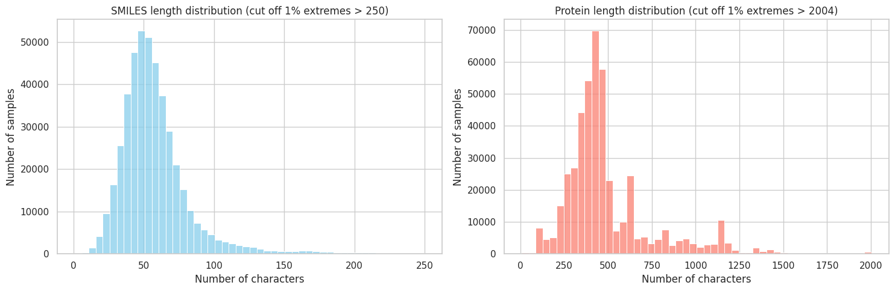
<figcaption>Overall length distributions for SMILES strings and protein
sequences (truncated at the 99th percentile for
visualization).</figcaption>
</figure>

Based on the distributions presented in Figure
[3.1](#fig:length_dist){reference-type="ref"
reference="fig:length_dist"}, the maximum input sequence lengths were
strategically set to 256 for drugs and 1024 for proteins. This
truncation constraint ensures computational memory efficiency while
preserving structural integrity, as only 0.95% of the drugs and 7.50% of
the proteins in the entire dataset exceed these respective limits.

### Topological Degree Distribution

The interaction network exhibits a heavy-tailed degree distribution,
typical of real-world biological systems.

<figure id="fig:degree_dist" data-latex-placement="htbp">
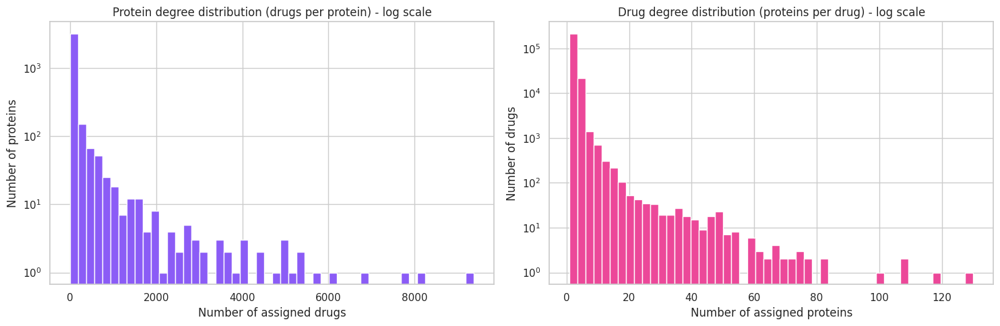
<figcaption>Log-scaled degree distributions representing the number of
drugs per protein (left) and the number of assigned proteins per drug
(right).</figcaption>
</figure>

As illustrated by the log-scaled histograms in Figure
[3.2](#fig:degree_dist){reference-type="ref"
reference="fig:degree_dist"}, a small subset of heavily researched
proteins is associated with thousands of documented ligands. Conversely,
the vast majority of drugs are mapped to only a single protein target.
This sparse network structure forces models to generalize across
isolated pairs rather than merely memorizing highly connected hub
targets.

### Evaluating Dataset Bias: Length by Class

A critical pitfall in artificially generated or randomly sampled
negative DTI datasets is the inadvertent introduction of length bias,
where inactive molecules might be significantly larger or smaller than
active ones. If such a bias is present, a neural network might simply
learn to separate classes based on the sequence length heuristic rather
than capturing the underlying physical chemistry of the binding process.

<figure id="fig:length_by_class" data-latex-placement="htbp">
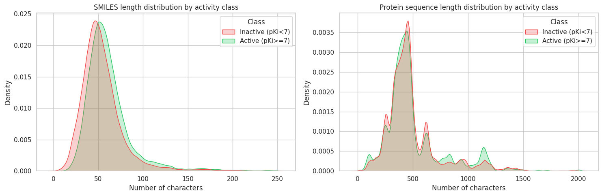
<figcaption>Density distributions of SMILES and protein sequence lengths
separated by the interaction class (Active vs. Inactive).</figcaption>
</figure>

To verify the integrity of the dataset, length distributions were
plotted conditionally based on the interaction class (Figure
[3.3](#fig:length_by_class){reference-type="ref"
reference="fig:length_by_class"}). The density plots for active
compounds (green) and inactive compounds (red) are nearly perfectly
aligned for both ligands and protein targets. This is consistent with
the absence of length bias, suggesting that the multimodal architectures
must discover genuine biochemical binding motifs to achieve high
accuracy.

### Target Activity Distribution

Although interaction prediction is framed as a binary classification
task, the labels originate from continuous $\text{p}K_i$ values, with an
activity threshold established at $\text{p}K_i = 7.0$
($K_i \leq 100\text{ nM}$).

<figure id="fig:pki_distribution" data-latex-placement="htbp">
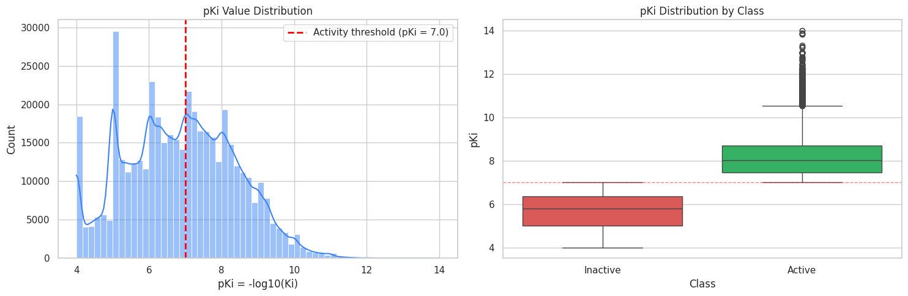
<figcaption>Distribution of continuous p<em>K</em><em>i</em> values
across the dataset (left) alongside class-separated boxplots (right),
with the red dashed line marking the activity threshold (p<em>K</em><em>i</em> = 7.0).</figcaption>
</figure>

The distribution spans a broad affinity range from
$\text{p}K_i \approx 4.0$ to $14.0$ (Figure
[3.4](#fig:pki_distribution){reference-type="ref"
reference="fig:pki_distribution"}). The histogram exhibits distinct
periodic spikes at integer values (e.g., $5.0, 6.0, 7.0$), which reflect
standard assay concentration cutoffs (such as $10\,\mu\text{M}$ or
$1\,\mu\text{M}$) commonly reported in bioactivity databases. Because
the classification threshold bisects a densely populated region of the
distribution, compounds with affinities near $\text{p}K_i = 7.0$
represent challenging borderline cases where subtle experimental
measurement noise can flip binary labels. The boxplot further confirms
balanced class spreads while highlighting a long tail of ultra-potent
binders in the active class reaching $\text{p}K_i > 12$.

### Cheminformatic Diversity: Murcko Scaffold Analysis

While sequence length distributions provide a high-level overview, a
rigorous evaluation of a Drug-Target Interaction dataset requires an
in-depth cheminformatic analysis of the underlying molecular structures.
Because the dataset was strictly divided using a scaffold-based
splitting strategy, it was imperative to understand the chemical
diversity at the structural core level. A scaffold represents the core
ring system of a molecule based on Murcko decomposition. If a small
number of scaffolds heavily dominate a dataset, machine learning models
run a severe risk of overfitting to those specific chemotypes.

<figure id="fig:scaffold_analysis" data-latex-placement="htbp">
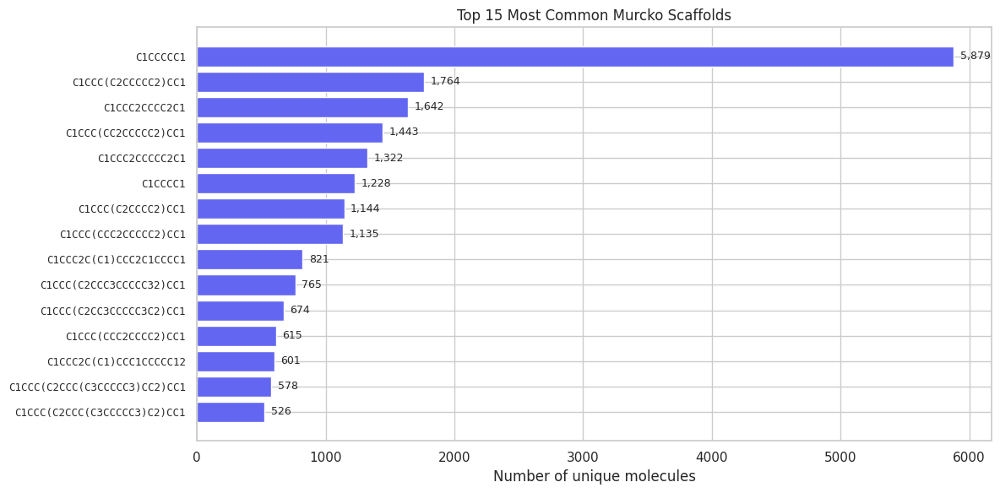
<figcaption>Murcko scaffold diversity analysis showcasing the top 15
most frequent scaffolds and the cumulative molecule coverage by scaffold
rank.</figcaption>
</figure>

The Murcko scaffold analysis successfully parsed the unique SMILES
strings to extract their generic ring structures. The analysis revealed
81,344 unique molecular scaffolds across the 236,379 unique ligand
SMILES, yielding a high scaffold-to-molecule diversity ratio of 34.41%.
The visualization of the top 15 most common scaffolds and the log-scaled
distribution of molecules per scaffold (Figure
[3.5](#fig:scaffold_analysis){reference-type="ref"
reference="fig:scaffold_analysis"}) reveals a healthy, long-tail
structural diversity. By quantifying how many distinct scaffolds are
required to cover 50% and 80% of the unique molecules, the analysis
confirms that the chemical space is broad and heterogeneous.

### Physicochemical Properties and Structural Complexity

To further assess the biochemical realism of the dataset, key
physicochemical descriptors were calculated and compared across the
active and inactive classes (Figure
[3.6](#fig:rdkit_features){reference-type="ref"
reference="fig:rdkit_features"}). The Molecular Weight (MW) strongly
peaks between 300 and 500 Da, while lipophilicity peaks between 2.5 and
4.5. Importantly, the MW and LogP density curves for active and inactive
pairs are nearly indistinguishable, suggesting the absence of trivial
size or solubility biases.

<figure id="fig:rdkit_features" data-latex-placement="H">
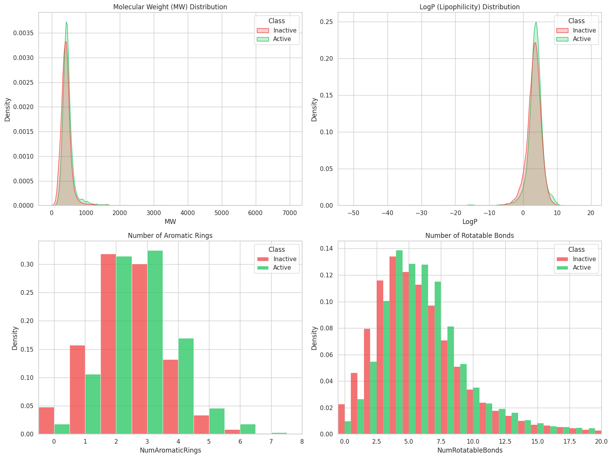
<figcaption>Physicochemical property distributions of the dataset,
illustrating drug-likeness (MW, LogP) and structural complexity
(Aromatic Rings, Rotatable Bonds) across active and inactive
classes.</figcaption>
</figure>

When it comes to structural complexity, there are subtle but important
differences. Active compounds usually have three aromatic rings, making
their core more rigid than inactive ones, which mostly feature two.
Interestingly, active molecules also maintain slightly more spatial
flexibility overall, as they more often contain between 5 and 7
rotatable bonds.

### Biological Integrity: Amino Acid Composition

To ensure that the predictive models learn fundamental binding
interactions rather than exploiting biological artifacts, the amino acid
composition across all protein sequences was rigorously compared between
the Active and Inactive classes.

<figure id="fig:amino_acid_composition" data-latex-placement="H">
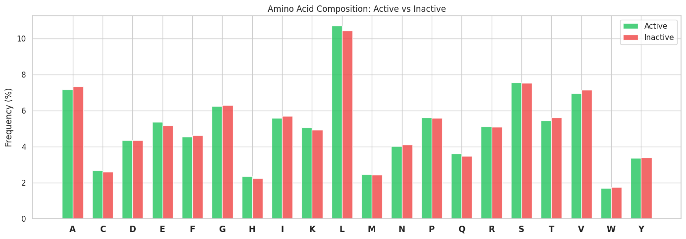
<figcaption>Frequency of individual amino acids compared between active
and inactive protein targets.</figcaption>
</figure>

As depicted in Figure
[3.7](#fig:amino_acid_composition){reference-type="ref"
reference="fig:amino_acid_composition"}, the frequency distributions for
the standard 20 amino acids remain highly consistent across both
categories. This verification ensures that specific protein types, such
as cysteine-rich or highly hydrophobic proteins, are not
disproportionately overrepresented in a single class. The minimal
percentage point differences between the groups suggest that the dataset
curation did not introduce a target-level composition bias.

## Baseline Model Implementation

The section describes deep learning models using some of the most
prominent algorithms in the current state-of-the-art: Graph
Convolutional Neural Networks (GCN) and Convolutional Neural Networks
(CNN).

### Graph Convolutional Neural Network

For the purpose of this research, a Graph Convolutional Neural Network
consisting of three convolutional layers was developed to extract
features from the chemical modality. Small molecules represented by
SMILES strings are first converted into graph structures using the Open
Graph Benchmark (OGB)[^2] featurization, where atoms serve as nodes and
chemical bonds as edges.

Before the convolutional operations, initial node features are generated
using the OGB *AtomEncoder*. This ensures each node represents rich
chemical properties (such as atomic number, chirality, and formal
charge) mapped into vectors with a hidden dimension size of 256.

<figure id="fig:gcn_architektura" data-latex-placement="htbp">
<embed src="./img/gcn.pdf" style="width:30.0%" />
<figcaption>Graph Convolutional Neural Network Architecture</figcaption>
</figure>

The preprocessed graph data is then forwarded through a stack of three
consecutive GCN layers. Each layer updates the atom representation by
aggregating information from its immediate neighbors. By stacking three
such layers, the network effectively captures chemical environments up
to three bonds away for each atom. A single GCN layer is built from
three sequential operations:

- **Graph Convolution Layer (GCNConv)** -- performs neighborhood
  aggregation.

- **Batch Normalization (BatchNorm1d)** -- stabilizes the learning
  process.

- **Activation Layer (LeakyReLU)** -- adds non-linearity to the network.

Finally, because each graph convolutional layer outputs an individual
embedding for each node, an aggregation operation is required. In the
research, Global Add Pooling is used to sum features from all nodes and
return a single, fixed-size vector of 256 dimensions representing the
structural and topological properties of the drug molecule.

### Convolutional Neural Networks

Convolutional Neural Networks are protein encoder architectures that
represent local relationships between amino-acids. Because protein
sequences differ in length, they are first truncated to a fixed-size of
1000 characters (only 7% of records in the dataset had to be truncated).
Each standard amino-acid in the sequence is tokenized, which means it
gets its unique identifier, with the index of 0 reserved for padding.

<figure id="fig:cnn_architektura" data-latex-placement="H">
<embed src="./img/cnn.pdf" style="width:45.0%" />
<figcaption>Convolutional Neural Network Architecture</figcaption>
</figure>

Each token is transformed into a feature vector of fixed-size equal to
256, called the embedding vector. To effectively capture biological
patterns, each embedded sequence is processed by a multi-scale 1D
Convolutional Neural Network. Unlike a standard CNN with a constant
filter size, the proposed architecture relies on three separate CNN
blocks, each with different kernel sizes: 3, 7, and 15. The multi kernel
approach empowers the network's ability to recognize local patterns
between amino-acids as well as broader structures. Each convolutional
block consists of two one-dimensional convolutional layers. After each
convolutional layer, batch normalization layers are used to stabilize
the training and reduce internal covariate shift. The activation
function (ReLU) is used to introduce non-linearity to the model. Since
the input sequences are padded to a fixed-length of 1000 tokens,
traditional pooling methods like average-pooling could be negatively
affected by artificial zero padding values. To mitigate this problem, a
max pooling layer is applied. This method converts zero padding values
with $-inf$ values to ensure only valid amino-acids contribute to
feature extraction. Finally, the outputs of each pooling layer are
concatenated. This results in a robust 384-dimensional vector that
captures essential biological properties of the target protein.

## Multi-modal Models Utilizing Advanced Descriptors

Building upon the structural baselines, this section introduces
predictive models powered by state-of-the-art molecular and biological
representations. It explores the transition from raw feature extraction
to the utilization of complex chemical fingerprints and large,
pre-trained language models, which are capable of capturing deep,
contextual properties of both drugs and target proteins.

### Fingerprints descriptor

While Graph Neural Networks operate directly on the topological
structure of molecules, molecular fingerprints offer an alternative,
highly efficient, and historically established method for representing
chemical properties. Fingerprints encode the presence or absence of
specific substructures within a molecule into a fixed-length bit array.

For this study, Extended-Connectivity Fingerprints (ECFP), a variant of
Morgan circular fingerprints, were generated using the
`scikit-fingerprints`[^3] library. The algorithm systematically analyzes
the chemical environment around each atom up to a specified radius.
Based on the experimental configuration, a radius of 2 was applied
(capturing interactions up to two bonds away), and the extracted
substructures were hashed into a discrete vector of 1024 dimensions.

<figure id="fig:fp_architektura" data-latex-placement="H">
<embed src="./img/fingerprint.pdf" style="width:40.0%" />
<figcaption>Fingerprint (ECFP) Architecture</figcaption>
</figure>

Because the raw fingerprint vector is inherently sparse and
high-dimensional, passing it directly into a multimodal fusion layer is
computationally suboptimal. Therefore, a dedicated Multilayer Perceptron
(MLP) encoder was implemented to project the 1024-dimensional bit vector
into a dense, continuous representation.

### Evolutionary Scale Modeling

While Convolutional Neural Networks excel at extracting local
dependencies between adjacent amino acids, they often struggle to
capture the global context of a sequence. To address this, Evolutionary
Scale Modeling (specifically ESM-2), a state-of-the-art
transformer-based protein language model, was utilized to capture
long-range relationships and complex structural patterns.

Given the model's immense scale (650 million parameters) and a chosen
maximum input length of 1024 tokens, full fine-tuning is computationally
intensive, even when utilizing high-performance hardware such as NVIDIA
GH200 accelerators. Therefore, the research employed two distinct
strategies to leverage ESM-2 efficiently.

First, all protein sequences were tokenized using the model's native
tokenizer. In the initial phase of the experiments, a feature extraction
approach was adopted. The pre-trained ESM-2 architecture was used in
inference mode to generate static embeddings for all proteins, which
were subsequently cached. To adapt these representations for the
downstream task, a projection head (consisting of a Linear layer, Layer
Normalization, and a ReLU activation function) was introduced to map the
output into a fixed-size vector of 1024 dimensions.

<figure id="fig:esm2_architektura" data-latex-placement="H">
<embed src="./img/esm2.pdf" style="width:40.0%" />
<figcaption>Evolutionary Scale Modeling Architecture</figcaption>
</figure>

In subsequent experiments, to further optimize model performance without
the prohibitive cost of full fine-tuning, the Low-Rank Adaptation (LoRA)
algorithm was implemented. This parameter-efficient fine-tuning
technique allowed the model to adapt its internal representations to the
specific drug-target interaction task while significantly reducing
training time and memory overhead.

### ChemBERTa

Analogous to the role of ESM-2 in protein representation, ChemBERTa is
employed to capture global, long-range dependencies within chemical
structures. Built upon the RoBERTa architecture, ChemBERTa was
pre-trained on approximately 77 million SMILES strings from PubChem,
allowing it to specialize in molecular representation tasks. While Graph
Convolutional Neural Networks (GCNs) effectively model local topological
neighborhoods, ChemBERTa provides a broader contextual understanding of
the entire molecule.

The integration strategy for this model closely mirrors the pipeline
established for the ESM-2 protein encoder. The primary distinction lies
in the modality-specific tokenizer and the foundational transformer
blocks. Following tokenization, the chemical representations are
processed through the ChemBERTa network and passed into an identical
projection head. This ensures that the resulting chemical embedding
matches the exact 1024-dimensional fixed size of the protein vector.

<figure id="fig:chembert_architektura" data-latex-placement="H">
<embed src="./img/chembert.pdf" style="width:35.0%" />
<figcaption>ChemBERTa Architecture</figcaption>
</figure>

Consistent with the experimental framework applied to the biological
modality, the initial phase utilized the pre-trained ChemBERTa model
strictly in inference mode, caching the static embeddings for downstream
projection. In subsequent experiments, the Low-Rank Adaptation (LoRA)
algorithm was similarly integrated. This approach enabled efficient,
task-specific fine-tuning of the chemical representations while
maintaining a significantly reduced computational footprint compared to
full model retraining.

### LINCS L1000 Transcriptomic Profiling Architectures

While structural and sequence-based descriptors capture static,
physicochemical properties, true biological domain knowledge is required
to reflect the dynamic consequences of drug administration. To this end,
the models were extended to consume transcriptomic signatures from the
Library of Integrated Network-based Cellular Signatures (LINCS) L1000
dataset. The preprocessing of this dataset, which yields a
978-dimensional continuous vector for each mapped drug, is detailed in
Section 3.1.3.

Within the neural architecture, two distinct integration strategies for
the LINCS modality were evaluated. First, a global Multi-Layer
Perceptron (MLP) encoder was designed (`LincsEncoder`), as illustrated
in Figure [3.13](#fig:lincs_mlp_architektura){reference-type="ref"
reference="fig:lincs_mlp_architektura"}.

<figure id="fig:lincs_mlp_architektura" data-latex-placement="H">
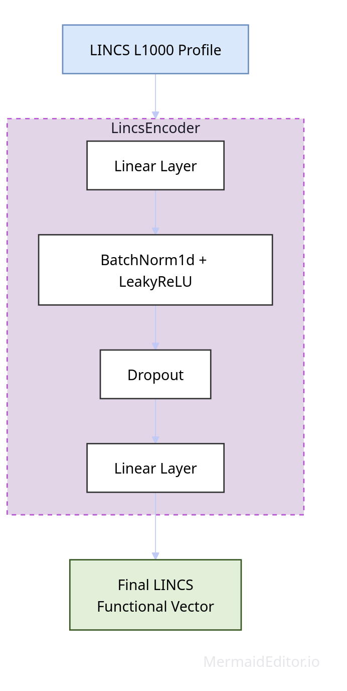
<figcaption>LINCS MLP Architecture</figcaption>
</figure>

The `LincsEncoder` receives a batch of $B$ samples, where each sample is
a 978-dimensional vector ($B \times 978$). Following the architecture
pattern established for the fingerprint descriptor, it consists of an
initial linear projection reducing the dimensionality from 978 to a
hidden dimension of 128. This is followed by a 1D batch normalization
layer, a standard ReLU activation function, and a dropout layer with a
probability of $p=0.5$ to prevent overfitting. A final linear projection
maps the data to the output size of 128 dimensions, which is
subsequently passed through another 1D batch normalization layer and a
ReLU activation. This pipeline effectively serves as a global functional
summary of the drug's mechanism of action.

Second, inspired by the DTIGCCN architecture, a novel node-level
`LincsGraphEncoder` was implemented, as depicted in Figure
[3.14](#fig:lincs_graph_architektura){reference-type="ref"
reference="fig:lincs_graph_architektura"}.

<figure id="fig:lincs_graph_architektura" data-latex-placement="H">
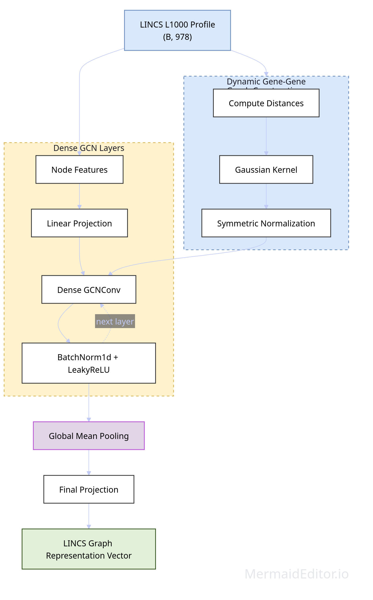
<figcaption>LINCS Dynamic Graph Architecture</figcaption>
</figure>

Unlike traditional molecular graphs where nodes are physical atoms, this
encoder dynamically constructs a fully connected graph treating each of
the 978 landmark genes as a separate node. The initial node features are
created by expanding the 978-dimensional input into a
$B \times 978 \times 1$ tensor and linearly projecting the single
feature to a predefined hidden dimension of 128. Simultaneously, the
adjacency matrix ($A$) defining the edge weights between these nodes is
computed dynamically using a Gaussian kernel function over the squared
L2 distances between gene Z-scores:
$$A_{i,j} = \exp\left(-\frac{(x_i - x_j)^2}{2\theta^2}\right)$$ This
formula ensures that genes exhibiting highly similar transcriptional
responses receive strong connection weights, simulating a co-expression
network. To maintain numerical stability during message passing, the
adjacency matrix undergoes symmetric normalization:
$A_{norm} = D^{-1/2} A D^{-1/2}$, where $D$ is the degree matrix. The
node features are then processed through standard Graph Convolutional
Network (GCN) layers, where information is propagated according to
$h = h \times A_{norm}$, followed by 1D batch normalization, a standard
ReLU activation, and a dropout layer. Finally, to produce a single
fixed-size embedding for the classification task, a global mean pooling
operation is applied across all 978 nodes, and a subsequent linear layer
projects the pooled vector to the final output dimension of 128. This
dual approach allowed for testing whether biological knowledge is better
consumed as a global functional summary or through explicitly modeling
the co-expression relationships between individual genes.

### Overall Experimental Architecture and Modality Fusion

A common limitation in current Drug-Target Interaction (DTI) research is
the tendency to propose single, isolated models. Most studies introduce
one new algorithm or a specific combination of encoders. They usually
show it works better than older baselines, but they rarely explore how
individual data types contribute, overlap, or work together. To address
this issue, the main goal of this research was not just to train another
standalone network. Instead, the aim was to build a flexible, modular
framework for systematic testing and comparison.

To achieve this, a modular dual-pathway architecture was designed, as
illustrated in Figure
[3.15](#fig:overall_architektura){reference-type="ref"
reference="fig:overall_architektura"}.

<figure id="fig:overall_architektura" data-latex-placement="H">
<embed src="./img/overall_architecture.pdf" style="width:90.0%" />
<figcaption>Overall architecture of the DTI experiments, showing the
dual-pathway design and fusion strategies.</figcaption>
</figure>

This architecture follows a \"late fusion\" approach. It consists of two
independent processing branches: the Drug Pathway and the Protein
Pathway. In each branch, the raw inputs (SMILES strings and protein
sequences) pass through a selected combination of the encoders described
earlier. The outputs from these active encoders are then combined
(concatenated) to form two fixed-size representations: a unified Drug
Vector and a unified Protein Vector.

To accurately test these representations and verify if adding more data
modalities always improves performance, an extensive combinatorial study
was performed. In total, 21 different model configurations were trained
and evaluated under the same conditions. This approach allows for a fair
comparison between simple baselines, such as a GCN paired with a CNN,
and highly complex models that use many encoders at once, such as
combining GCN, Fingerprints, and ChemBERTa for the drug with CNN and
ESM-2 for the protein.

To generate the 21 distinct model configurations, a systematic
permutation strategy was applied. The models were constructed by
methodically mixing and matching the available chemical encoders (GCN,
ChemBERTa, Fingerprints) with the biological encoders (1D-CNN, ESM-2).
The generation process started with simple dual-encoder baselines,
containing exactly one drug encoder and one protein encoder (for
example, a Drug GCN paired with a Protein CNN). From these baselines,
the architecture was incrementally expanded by adding one encoder at a
time. This step-by-step permutation strategy culminated in a fully
loaded, five-encoder architecture that utilized all available processing
pathways simultaneously. By building the models in this structured way,
it was possible to track the exact performance of every single data
modality and its corresponding model.

#### Phase 1: Multilayer Perceptron (MLP) Fusion and Fair Benchmarking

In the first phase, the interaction between drugs and proteins was
modeled using a standard Multilayer Perceptron (MLP). The unified Drug
Vector and Protein Vector are joined together (concatenated) into a
single, continuous feature vector.

This combined vector is then passed to the MLP classification head. The
network uses fully connected layers that gradually decrease in size. To
ensure the model learns general patterns and does not overfit, each
linear layer is followed by a 1D Batch Normalization layer, a ReLU
activation function, and a Dropout layer. The final layer outputs a
single probability score using a Sigmoid activation, and the network is
optimized using the standard Binary Cross-Entropy (BCE) loss function.

A major challenge when comparing many different models is ensuring a
fair test. Because each encoder produces a fixed-size vector, models
that use more encoders create much larger combined vectors. To prevent
simple models from overfitting and complex models from losing
information, the size of the MLP classification head was scaled
dynamically based on the input size.

Specifically, the MLP had two hidden layers: the first layer was exactly
half the size of the concatenated input, and the second layer was
one-eighth the size of the input (with a minimum limit of 64 neurons).
For example, if a complex model had an input vector of 1408 features,
the hidden layers were scaled to 704 and 176 neurons. For a simpler
model with an input size of 512, the hidden layers were scaled to 256
and 64. This ensured that the mathematical compression ratio remained
exactly the same for every single model.

Furthermore, each additional encoder increased the total number of
parameters, making complex models more likely to overfit the training
data. To fix this and keep the comparison fair, an adaptive Dropout
strategy was used. The dropout rate was calculated based on the number
of active encoders using the formula:
$\text{Dropout} = 0.3 + 0.05 \times (N - 2)$, where $N$ is the total
number of encoders. As a result, a simple dual-encoder model used a
dropout rate of 0.3, while the most complex model with five encoders
used a dropout rate of 0.45. This guaranteed that larger models received
stronger regularization.

#### Phase 2: Cross-Attention Integration and Parameter-Efficient Fine-Tuning

A standard MLP effectively captures non-linear relationships, but it
assumes that drug and protein features are independent before fusion. In
biological systems, binding is a dynamic process where a drug molecule
aligns with a specific binding pocket. To model this mutual interaction,
the second phase of this research utilizes a Cross-Attention Fusion
mechanism.

Because the individual drug and protein encoders output fixed-size
global embeddings, passing these isolated representations directly into
a standard cross-attention module presents a technical challenge. If an
attention mechanism receives a sequence of length 1, the Softmax
operation becomes degenerate, assigning a weight of 1.0 and passing the
input unchanged. To address this, a custom gating-attention fusion
module (`CrossAttentionFusion`) was implemented.

Initially, the drug and protein output vectors are linearly projected to
a shared dimensional space ($proj\_dim = 256$). These projections are
then stacked to form a unified two-token sequence: $[DRUG, PROTEIN]$.
This concatenated sequence ($B \times 2 \times proj\_dim$) serves
simultaneously as the Query ($Q$), Key ($K$), and Value ($V$) for a
multi-head attention mechanism. This configuration produces a
non-degenerate $2 \times 2$ attention matrix, computing the cross-modal
influence between the drug and the protein.

The architecture consists of two stacked `MultiheadAttention` layers (4
attention heads, base dropout 0.35), utilizing residual connections and
Layer Normalization. After the attention blocks, the two-token sequence
is unpacked back into distinct, attention-enriched drug ($s$) and
protein ($p$) vectors. A learned gating mechanism controls their
combination: $$g = \sigma(W_{gate} [s; p])$$
$$fused = g \times s + (1 - g) \times p$$ This fused representation is
passed to an MLP classification head to yield the binary prediction.

Unlike the first phase, which relied on static cached features, this
phase employs parameter-efficient fine-tuning. The ESM-2 and ChemBERTa
encoders are dynamically fine-tuned using Low-Rank Adaptation (LoRA)
with a rank of $r=16$, an alpha scaling factor of $\alpha=16$, and an
adapter dropout of $0.1$. The use of trainable low-rank matrices allows
the models to adapt to the DTI task with reduced memory and
computational overhead compared to full fine-tuning.

Given the high computational cost of training attention mechanisms and
fine-tuning transformers, the Cross-Attention and LoRA experiments were
restricted to the top ten performing models from Phase 1. This limited
the resource-intensive training exclusively to the most promising
structural architectures.

#### Phase 3: Integration of Biological Prior Knowledge (LINCS L1000)

Building on the structural and sequence-based models developed in
earlier phases, Phase 3 introduces the LINCS L1000 transcriptomic data.
While the initial phases focus on analyzing the static chemical topology
of the drug and the physical sequence of the protein target, they lack
the capacity to reflect the dynamic biological response triggered inside
a living cell.

To address this limitation, the third phase is designed to integrate the
`LincsEncoder` and `LincsGraphEncoder` with the top-performing
structural encoders identified previously. By fusing these biological
descriptors with the existing chemical pathways, the objective is to
evaluate whether dynamic domain knowledge can improve the prediction of
complex drug-target interactions. Similar to Phase 1, multiple model
configurations will be trained and systematically compared to measure
the exact predictive benefit of adding this transcriptomic information.

# Experimental Results and Discussion

## Phase 1 Results

Phase 1 of the experiments covered 21 distinct multi-modal architectures
utilizing simple Multilayer Perceptron (MLP) fusion. The comprehensive
results are presented in Table
[\[tab:fusion_models_auc\]](#tab:fusion_models_auc){reference-type="ref"
reference="tab:fusion_models_auc"}. All six top-performing architectures
(sorted by AUC) include the Graph Convolutional Neural Network (GCN)
encoder. This indicates that explicit molecular graph
topology-representing atoms as nodes and bonds as edges-provides a
significantly stronger inductive bias for Drug-Target Interaction
prediction than either fixed-length molecular fingerprints or contextual
SMILES representations derived from pre-trained language models.

In contrast to the structural models, architectures relying entirely on
ChemBERTa as the drug encoder occupy the lowest positions in the
evaluation table (AUC $\approx$ 0.86). This implies that while language
models excel at generative tasks or sequence-to-sequence mapping, 1D
SMILES tokenization may not capture the 3D spatial and chemical binding
constraints as effectively as direct graph convolutions.

Furthermore, three of the top four performing models utilize GCN as the
sole drug encoder. This highlights a critical phenomenon: increasing the
complexity of the drug representation through naive concatenation does
not yield better performance. For instance, the baseline `gcn_and_cnn`
model achieved the highest overall AUC (0.8957). Adding ChemBERTa to
this combination (`gcn_chembert_and_cnn`) degraded the AUC to 0.8908,
and combining all three drug encoders (`gcn_fp_chembert_and_cnn`)
further lowered it to 0.8826. This suggests that, without an advanced
attention mechanism, the MLP fusion module struggles to extract a
unified signal from an overly wide concatenated vector, possibly due to
feature redundancy, increased optimization difficulty, and the stronger
regularization applied to models with more encoders.

In the context of real-world drug discovery, particularly during
early-stage virtual screening where the testing budget is less
restricted, the recall metric often becomes more important than
precision or even overall AUC. Missing a potentially valuable drug
candidate represents a significant missed opportunity for a
pharmaceutical company. Testing an inactive compound in the laboratory,
while slightly inefficient, is an acceptable cost.

When looking at the results from this perspective, the
`gcn_and_cnn_esm2` model emerges as the most valuable architecture. It
achieves the highest recall in the entire experiment (0.8220), meaning
it successfully identifies over 82% of all actual active interactions.
By utilizing both the local patterns from the CNN and the global
evolutionary context from ESM-2, the model provides broad coverage of
potential candidates.

On the opposite end of the spectrum, models heavily reliant on molecular
fingerprints act completely differently. For example, the
`fp_chembert_and_esm2` model boasts the highest Precision (0.8569),
meaning it is highly confident in its positive predictions. However, its
Recall drops to 0.6749. This makes the model conservative: it minimizes
false alarms but misses about a third of all valid drug-target pairs.

A separate comparison was conducted to evaluate the impact of the
biological representations, specifically contrasting the lightweight
1D-CNN with the large, pre-trained ESM-2 transformer. As demonstrated in
Table [4.1](#tab:cnn_and_esm2){reference-type="ref"
reference="tab:cnn_and_esm2"}, across identical chemical encoders, the
CNN architecture consistently outperforms ESM-2 in terms of AUC (the
advantage holds for all seven drug-encoder groups). For F1-Score, the
pattern is similar, with one exception: with Fingerprint as the sole
drug encoder, ESM-2 yields a higher F1 (0.7873 vs 0.7738).

This result highlights a critical biological intuition: the occurrence
of a drug-target interaction is often dictated by highly localized
binding pockets and short amino acid motifs rather than the global 3D
folding structure of the entire protein. While ESM-2 is designed to
capture far-reaching evolutionary dependencies, the local convolutions
of the CNN appear to be much more efficient at extracting the specific,
localized patterns relevant to binding affinity. Furthermore, the large
size of the ESM-2 embeddings may introduce excessive noise during the
simple MLP concatenation phase, whereas the compact features generated
by the CNN integrate much more smoothly with the drug representations.

::: {#tab:cnn_and_esm2}
+-------------------+------------------------+-------------------------+
| **Drug            | **AUC**                | **F1-Score**            |
| Representation**  |                        |                         |
+:==================+:==========:+:=========:+:==========:+:==========:+
| 2-3 (lr)4-5       | **CNN**    | **ESM-2** | **CNN**    | **ESM-2**  |
+-------------------+------------+-----------+------------+------------+
| GCN               | **0.8957** | 0.8905    | **0.8133** | 0.8071     |
+-------------------+------------+-----------+------------+------------+
| Fingerprint (FP)  | **0.8813** | 0.8779    | 0.7738     | **0.7873** |
+-------------------+------------+-----------+------------+------------+
| ChemBERTa         | **0.8648** | 0.8591    | **0.7804** | 0.7739     |
+-------------------+------------+-----------+------------+------------+
| GCN + FP          | **0.8835** | 0.8759    | **0.8001** | 0.7926     |
+-------------------+------------+-----------+------------+------------+
| GCN + ChemBERTa   | **0.8908** | 0.8808    | **0.8081** | 0.7957     |
+-------------------+------------+-----------+------------+------------+
| FP + ChemBERTa    | **0.8840** | 0.8768    | **0.7788** | 0.7551     |
+-------------------+------------+-----------+------------+------------+
| GCN + FP +        | **0.8826** | 0.8761    | **0.7979** | 0.7971     |
| ChemBERTa         |            |           |            |            |
+-------------------+------------+-----------+------------+------------+

: Comparison of Protein Encoders (CNN and ESM-2) across Identical Drug
Representations
:::

To better understand the differences in model performance, a visual
analysis was conducted. Three specific models were selected for this
comparison: the overall best model (`gcn_and_cnn`), the most complex
model (`gcn_fp_chembert_and_cnn_esm2`), and the worst-performing model
(`chembert_and_esm2`).

Figure [4.1](#fig:best_model){reference-type="ref"
reference="fig:best_model"} presents the results for the `gcn_and_cnn`
architecture. The t-SNE projection (Figure
[4.1](#fig:best_model){reference-type="ref"
reference="fig:best_model"}d) shows a clear separation between active
and inactive interactions. Because the model groups these classes
effectively, the Confusion Matrix (Figure
[4.1](#fig:best_model){reference-type="ref"
reference="fig:best_model"}c) is balanced. The number of false positives
(8,205) and false negatives (8,468) is similar, resulting in the highest
overall predictive performance in the experiment, with an AUC of 0.8957
(Figure [4.1](#fig:best_model){reference-type="ref"
reference="fig:best_model"}a) and an AUPRC of 0.8946 (Figure
[4.1](#fig:best_model){reference-type="ref"
reference="fig:best_model"}b).

<figure id="fig:best_model" data-latex-placement="H">
<figure>
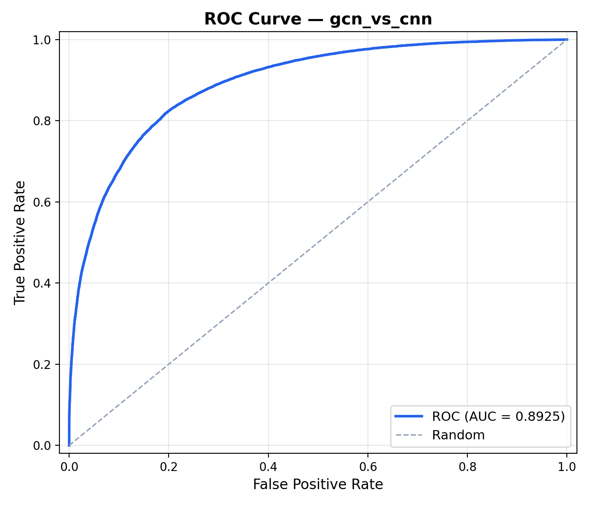
<figcaption>ROC Curve</figcaption>
</figure>
<figure>
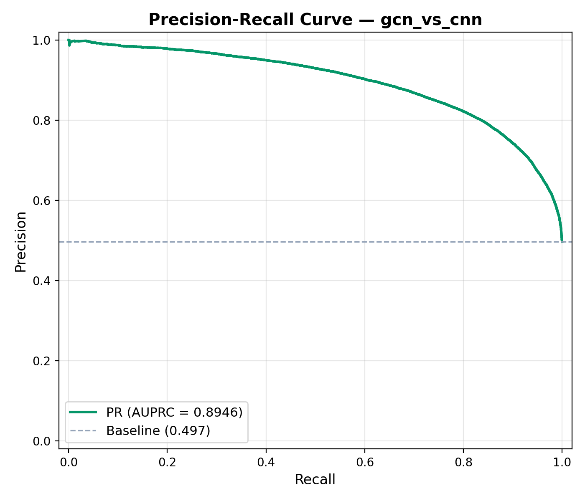
<figcaption>Precision-Recall Curve</figcaption>
</figure>
<figure>
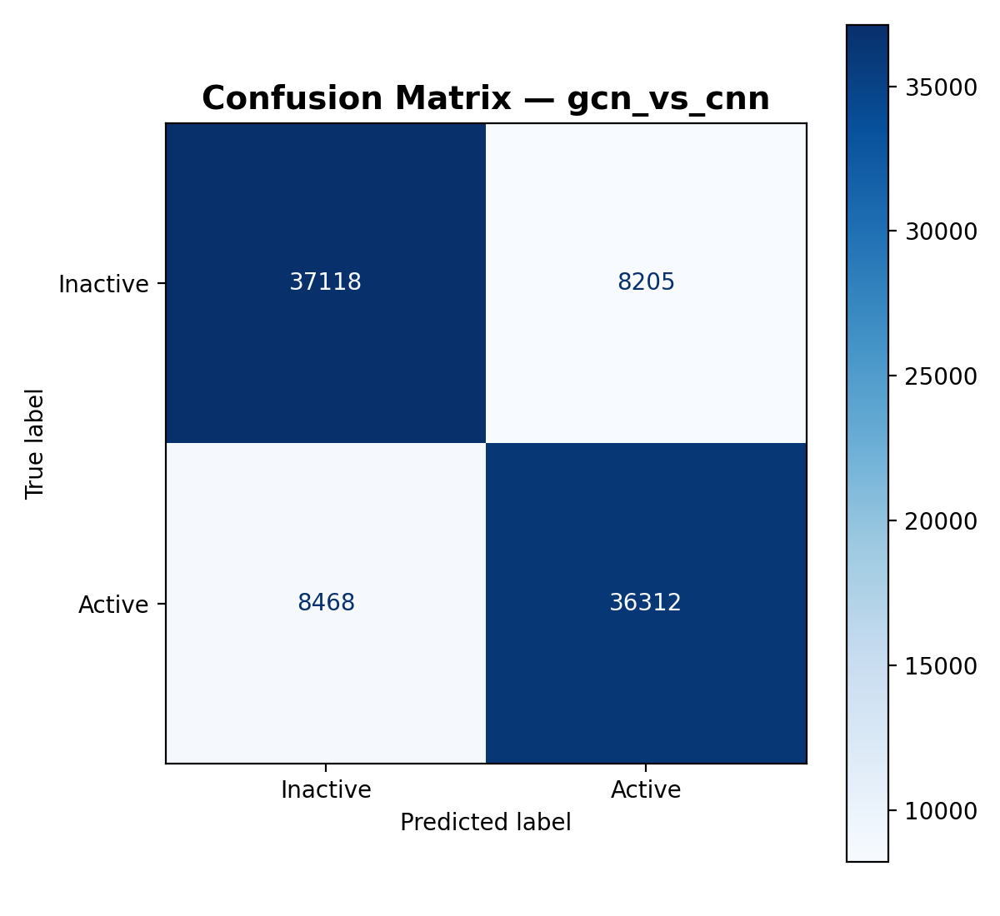
<figcaption>Confusion Matrix</figcaption>
</figure>
<figure>
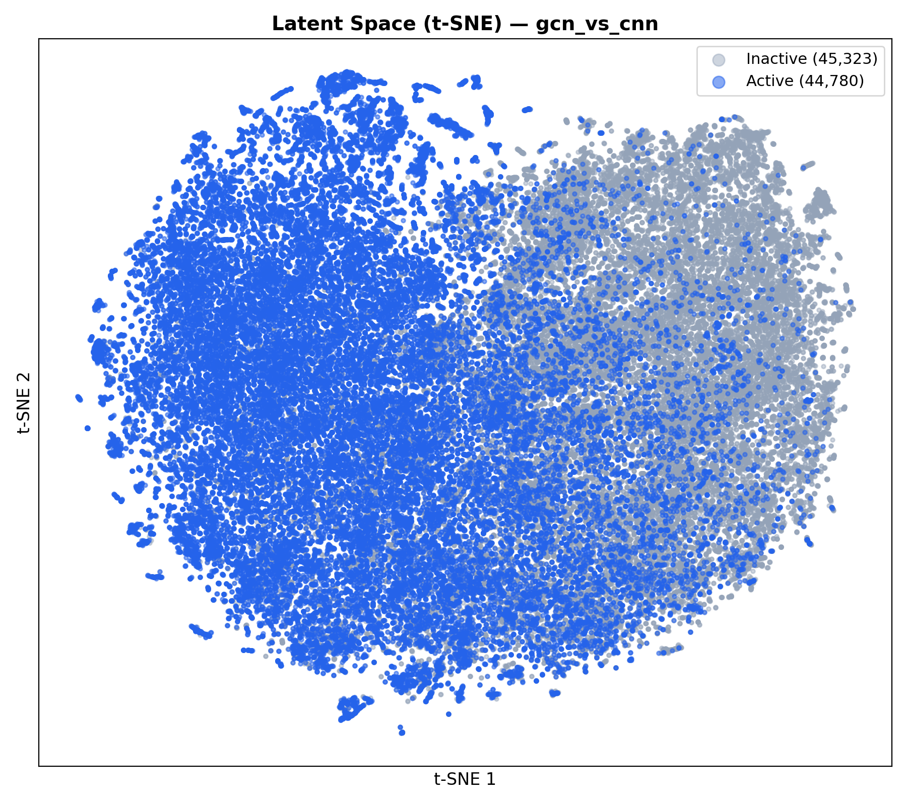
<figcaption>t-SNE Latent Space</figcaption>
</figure>
<figcaption>Visual diagnostics for the best-performing model
(<code>gcn_and_cnn</code>).</figcaption>
</figure>

In contrast, Figure [4.2](#fig:complex_model){reference-type="ref"
reference="fig:complex_model"} presents the results for the most complex
architecture. Even though this model utilizes the highest number of
extracted features, the t-SNE plot (Figure
[4.2](#fig:complex_model){reference-type="ref"
reference="fig:complex_model"}d) shows a larger overlap between the
active and inactive classes in the central region of the latent space.
The high dimensionality of the concatenated embeddings, combined with
feature redundancy and stronger adaptive regularization, makes it harder
for the MLP to establish a clear decision boundary. This is visible in
the Confusion Matrix (Figure
[4.2](#fig:complex_model){reference-type="ref"
reference="fig:complex_model"}c), where the number of false negatives
rises to 10,834 (compared to 8,786 in the baseline model). Consequently,
the overall predictive performance drops, resulting in an AUC of 0.8853
and an AUPRC of 0.8852 (Figures
[4.2](#fig:complex_model){reference-type="ref"
reference="fig:complex_model"}a and
[4.2](#fig:complex_model){reference-type="ref"
reference="fig:complex_model"}b).

<figure id="fig:complex_model" data-latex-placement="H">
<figure>
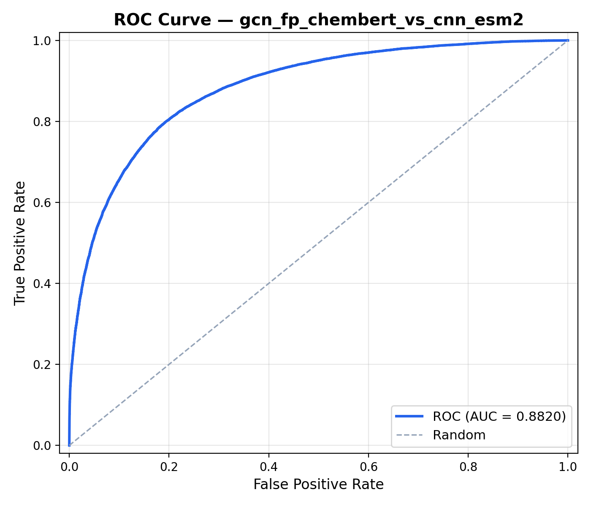
<figcaption>ROC Curve</figcaption>
</figure>
<figure>
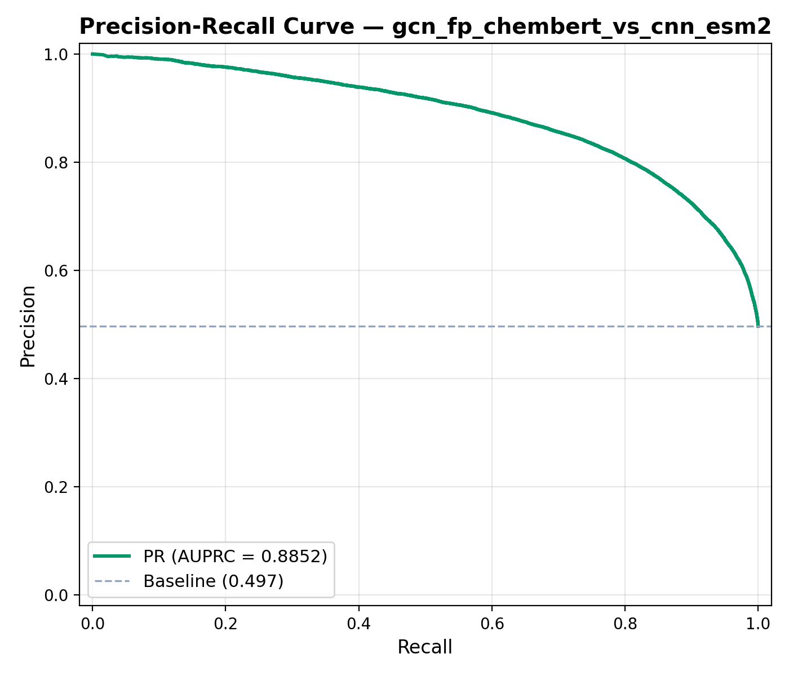
<figcaption>Precision-Recall Curve</figcaption>
</figure>
<figure>
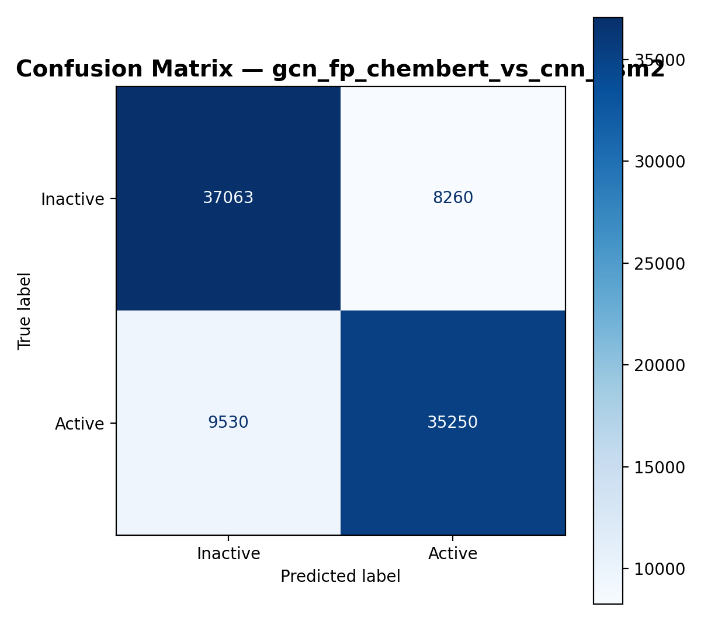
<figcaption>Confusion Matrix</figcaption>
</figure>
<figure>
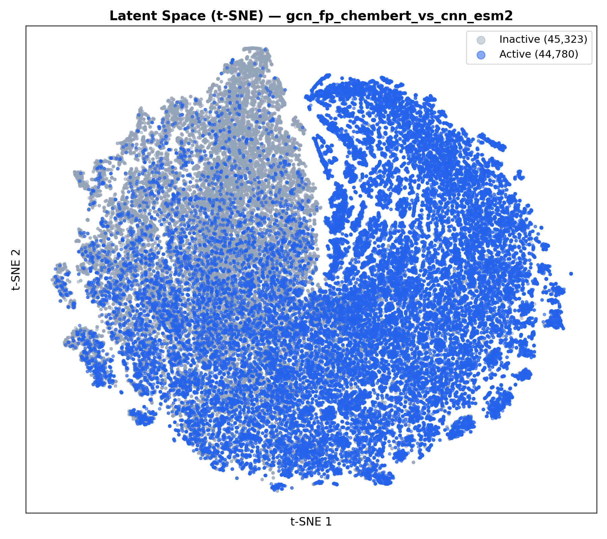
<figcaption>t-SNE Latent Space</figcaption>
</figure>
<figcaption>Visual diagnostics for the most complex model
(<code>gcn_fp_chembert_and_cnn_esm2</code>).</figcaption>
</figure>

Finally, Figure [4.3](#fig:worst_model){reference-type="ref"
reference="fig:worst_model"} shows why architectures relying exclusively
on pre-trained language models (without explicit graph structures)
achieve lower predictive performance. The t-SNE projection for
`chembert_and_esm2` (Figure [4.3](#fig:worst_model){reference-type="ref"
reference="fig:worst_model"}d) indicates a large overlap between the
active and inactive classes. This suggests that processing molecules and
proteins solely as 1D text sequences may not capture sufficient spatial
and topological information to accurately model physical binding.
Consequently, the Precision-Recall curve (Figure
[4.3](#fig:worst_model){reference-type="ref"
reference="fig:worst_model"}b) has a lower AUPRC (0.8594), and the
Confusion Matrix (Figure [4.3](#fig:worst_model){reference-type="ref"
reference="fig:worst_model"}c) shows a high error rate, with 10,021
false positives and 10,190 false negatives, resulting in the lowest
overall AUC score (0.8591) in the experiment.

<figure id="fig:worst_model" data-latex-placement="H">
<figure>
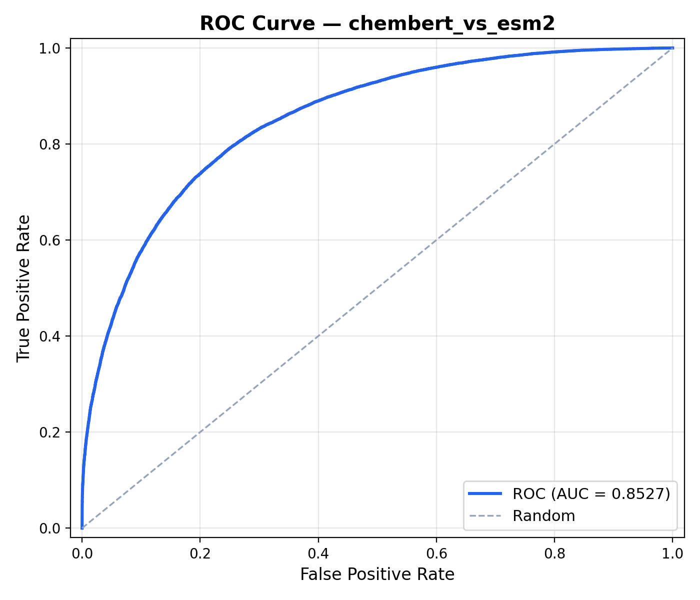
<figcaption>ROC Curve</figcaption>
</figure>
<figure>
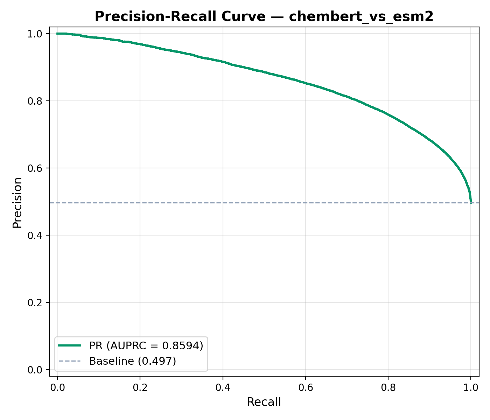
<figcaption>Precision-Recall Curve</figcaption>
</figure>
<figure>
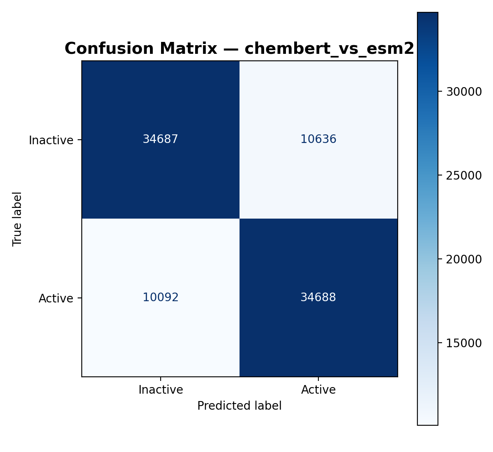
<figcaption>Confusion Matrix</figcaption>
</figure>
<figure>
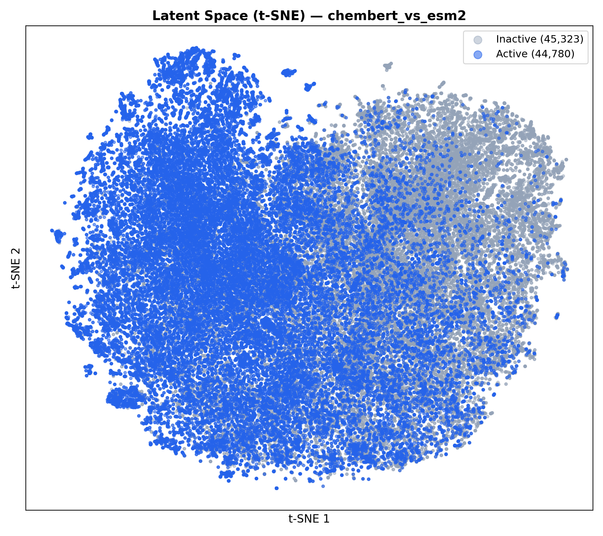
<figcaption>t-SNE Latent Space</figcaption>
</figure>
<figcaption>Visual diagnostics for the lowest-performing model
(<code>chembert_and_esm2</code>).</figcaption>
</figure>

Overall, despite the differences in multimodal architectures, all
evaluated models achieved relatively similar results. The performance
gap between the top model (`gcn_and_cnn`, AUC 0.8957) and the
lowest-performing model (`chembert_and_esm2`, AUC 0.8591) is less than 4
percentage points. This narrow variance suggests that the dataset
itself, combined with the scaffold splitting strategy, imposes a natural
performance ceiling. Furthermore, it indicates that while explicit graph
representations (GCN) provide the best predictive performance, purely
text-based language models are still capable of extracting meaningful
biological and chemical patterns.

## Phase 2 Results

In Phase 2, the simple MLP fusion was replaced with a Cross-Attention
mechanism. However, this approach did not improve the results. As shown
in Table
[\[tab:phase1_vs_phase2\]](#tab:phase1_vs_phase2){reference-type="ref"
reference="tab:phase1_vs_phase2"}, the cross-attention models scored
about 1% lower in AUC compared to their MLP counterparts across the 10
tested architectures.

It is important to note that Phase 2 introduced three changes at the
same time:

- The MLP was replaced with a cross-attention module,

- LoRA fine-tuning was enabled for the ChemBERTa and ESM-2 encoders,

- The training switched from cached embeddings to dynamic forward
  passes.

Because of these multiple changes, the drop in performance cannot be
blamed on the cross-attention mechanism alone.

There are a few logical reasons for this overall performance drop.
First, attention mechanisms have significantly more parameters than
simple MLPs. This makes them much harder to train and more prone to
overfitting on the training data. Second, cross-attention is generally
designed for processing detailed, element-by-element sequences (like
translating words in a sentence). In the present architecture, the
module tries to align highly compressed global vectors (like
Fingerprints or pooled GCN features). Without raw, uncompressed
sequences to map, the attention mechanism cannot use its full potential
and might act more like an unnecessary noise filter.

However, a closer look at the rankings reveals a very interesting shift.
In Phase 1, the simple MLP model struggled to process too many features
at once. Adding ChemBERTa to the GCN encoder actually lowered the
results. But in Phase 2, the `gcn_chembert_and_cnn` architecture takes
first place.

This suggests that while Cross-Attention may introduce excessive
overhead for simple encoder combinations, it is better suited than MLP
for filtering and merging information from multiple complex sources.

In terms of specific metrics for Phase 2, the
`gcn_fp_chembert_and_cnn_esm2` model achieved the highest Recall
(0.8276), meaning it is the best at finding true positive interactions,
though at the cost of lower precision. Finally, the lowest cross-entropy
loss belongs to `gcn_and_cnn_esm2`, showing that this specific
combination is the most stable during training. Ultimately, while
Cross-Attention solves the problem of combining many complex encoders,
the simple MLP from Phase 1 remains a more practical and effective
choice for this specific dataset.

Similar to the methodology applied in Phase 1, a visual diagnostic
analysis was conducted to better understand the internal behavior of the
cross-attention architectures. Figure
[4.4](#fig:phase2_best_model){reference-type="ref"
reference="fig:phase2_best_model"} presents the performance of the best
Phase 2 architecture (`gcn_chembert_and_cnn`). The t-SNE projection
(Figure [4.4](#fig:phase2_best_model){reference-type="ref"
reference="fig:phase2_best_model"}d) demonstrates a clear separation
between the active and inactive classes. The cross-attention mechanism
aligned the 2D structural graph signals with the 1D contextual language
embeddings, achieving high Recall. However, as seen in the Confusion
Matrix (Figure [4.4](#fig:phase2_best_model){reference-type="ref"
reference="fig:phase2_best_model"}c), this higher recall resulted in
9,959 False Positives, causing a slight drop in overall Precision
compared to the Phase 1 baseline.

<figure id="fig:phase2_best_model" data-latex-placement="H">
<figure>
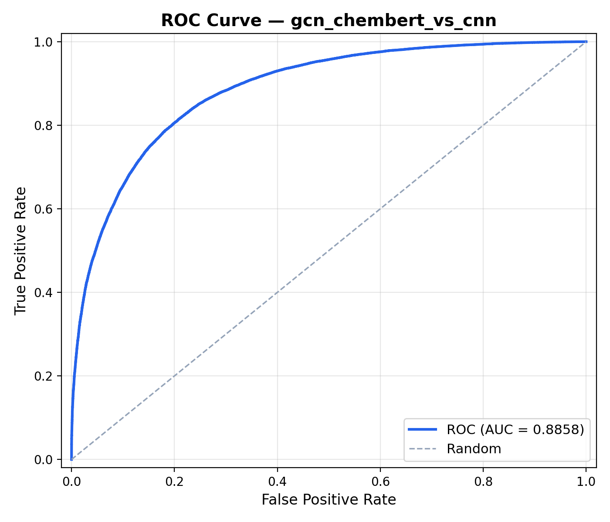
<figcaption>ROC Curve</figcaption>
</figure>
<figure>
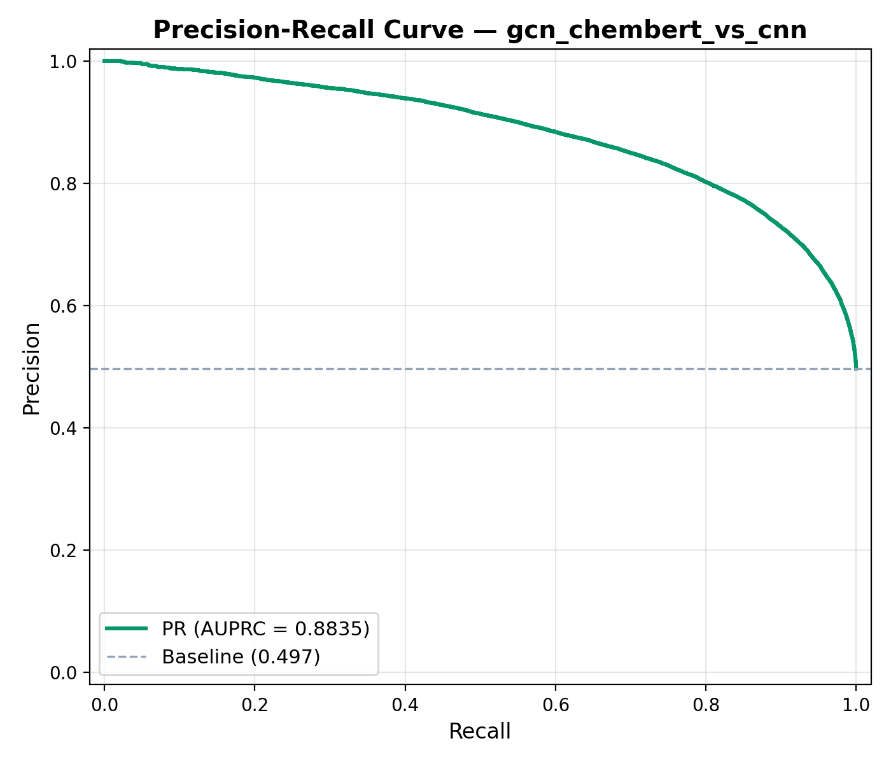
<figcaption>Precision-Recall Curve</figcaption>
</figure>
<figure>

<figcaption>Confusion Matrix</figcaption>
</figure>
<figure>
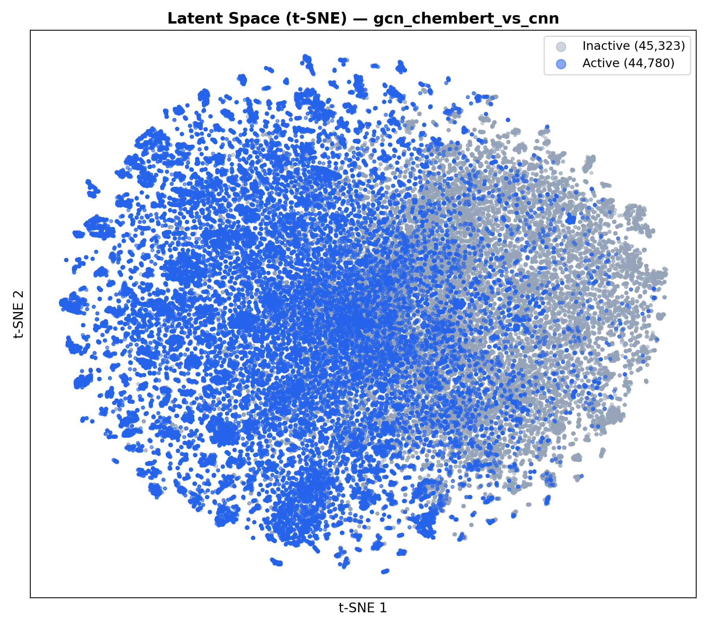
<figcaption>t-SNE Latent Space</figcaption>
</figure>
<figcaption>Visual diagnostics for the best-performing Phase 2 model
(<code>gcn_chembert_and_cnn</code>).</figcaption>
</figure>

In contrast, Figure [4.5](#fig:phase2_overloaded){reference-type="ref"
reference="fig:phase2_overloaded"} illustrates the severe impact of
modal overload on the cross-attention mechanism, using the fully
multimodal architecture (`gcn_fp_chembert_and_cnn_esm2`). Theoretical
intuition suggests that aggregating multiple distinct representations by
merging 2D graphs, 1D sequences, advanced language model embeddings, and
physicochemical fingerprints will naturally yield a superior model.
However, when forced to align five distinct encoders simultaneously, the
latent space (Figure [4.5](#fig:phase2_overloaded){reference-type="ref"
reference="fig:phase2_overloaded"}d) collapses into a noisy, entangled
cluster. The increased number of encoder outputs competing for attention
impairs the module's ability to establish a robust decision boundary.
Consequently, the Confusion Matrix (Figure
[4.5](#fig:phase2_overloaded){reference-type="ref"
reference="fig:phase2_overloaded"}c) shows the highest number of False
Positives among Phase 2 models (10,447). While the model manages to
catch many true interactions, the precision degradation is evident in
the Precision-Recall curve (Figure
[4.5](#fig:phase2_overloaded){reference-type="ref"
reference="fig:phase2_overloaded"}b), yielding a lower AUPRC of 0.8707.
This suggests that even advanced attention mechanisms cannot fully
compensate for excessive informational noise.

<figure id="fig:phase2_overloaded" data-latex-placement="H">
<figure>
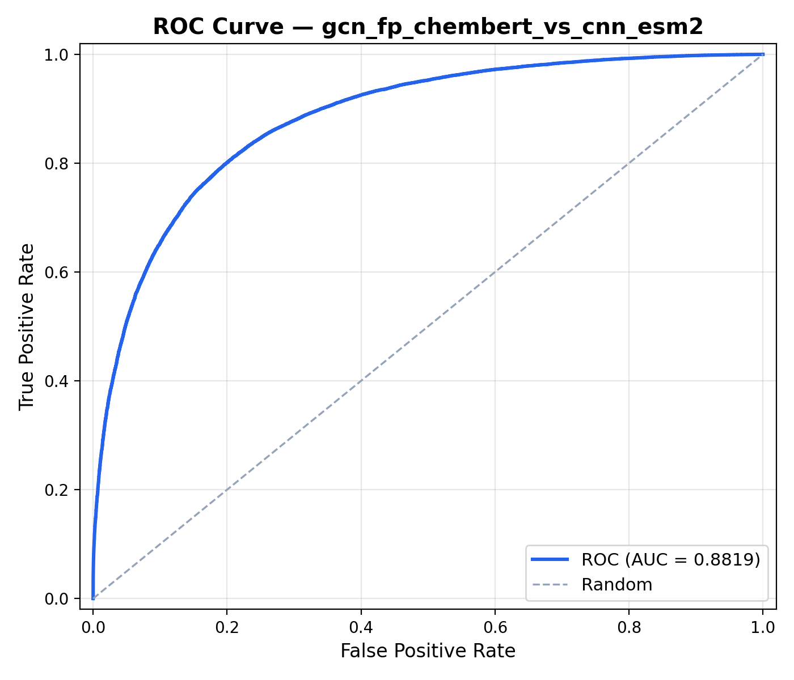
<figcaption>ROC Curve</figcaption>
</figure>
<figure>
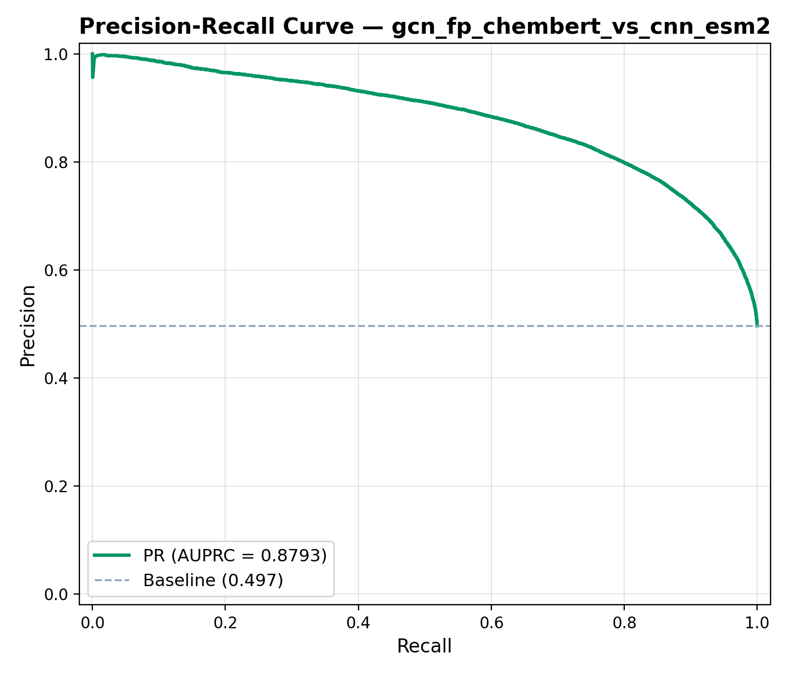
<figcaption>Precision-Recall Curve</figcaption>
</figure>
<figure>
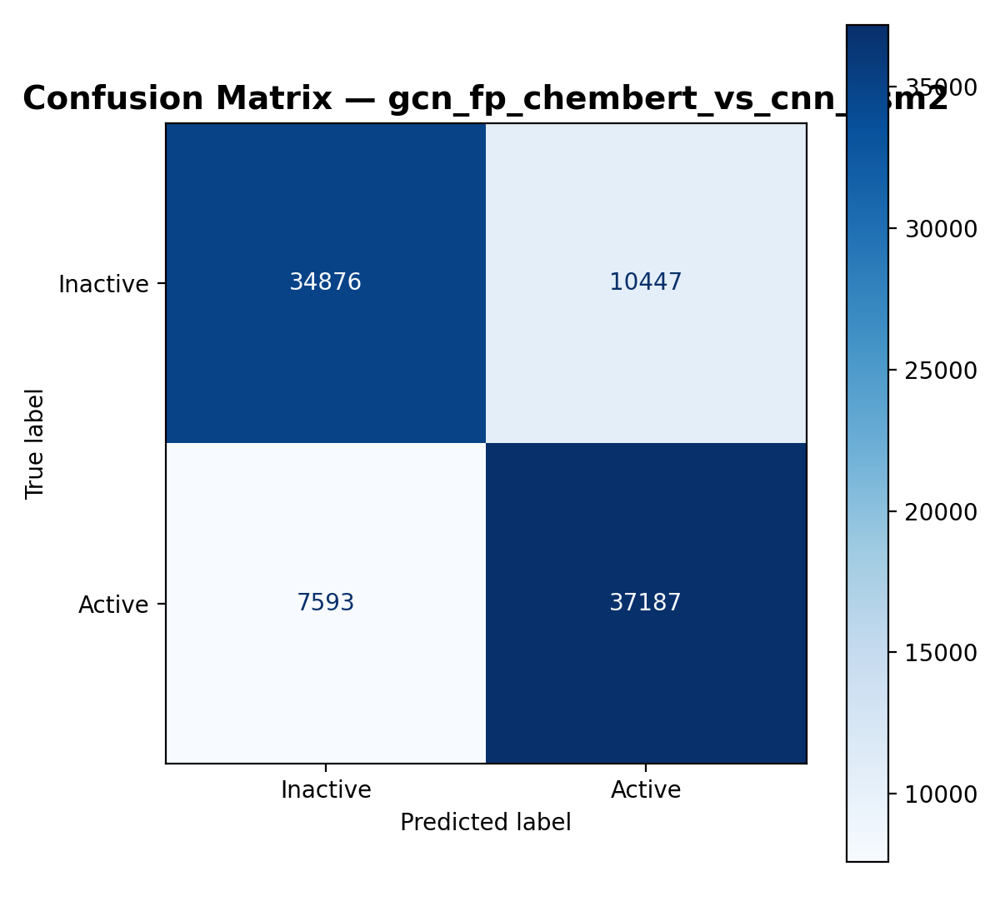
<figcaption>Confusion Matrix</figcaption>
</figure>
<figure>
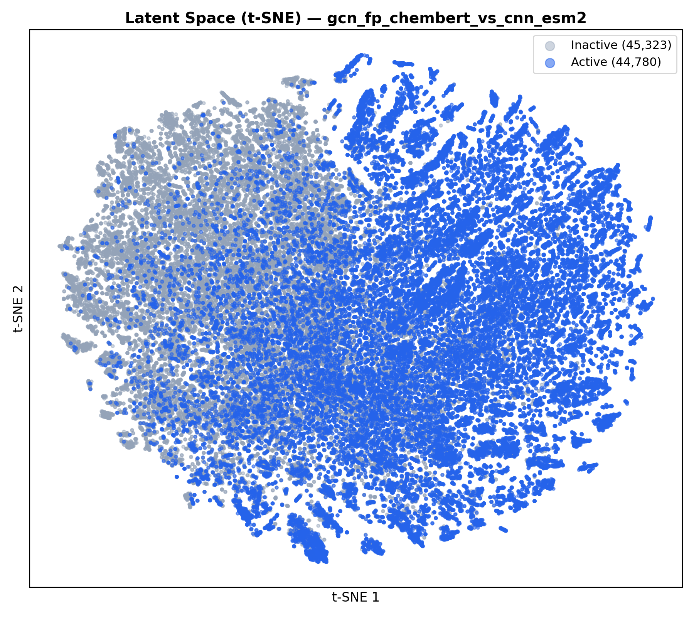
<figcaption>t-SNE Latent Space</figcaption>
</figure>
<figcaption>Visual diagnostics for the overloaded Phase 2 model
(<code>gcn_fp_chembert_and_cnn_esm2</code>).</figcaption>
</figure>

## Comparative Error Analysis and Molecular Diagnostics {#sec:error_analysis}

To fully understand the practical differences and underlying mechanics
of the developed architectures, a comparative error analysis was
performed. The evaluation contrasts the best baseline fusion model
(`gcn_and_cnn`) with the best cross-attention model
(`gcn_chembert_and_cnn`). By dissecting the predictions into True
Positives, True Negatives, False Positives, and False Negatives, it is
possible to analyze how specific molecular properties and probability
distributions influence the models' behavior.

### Prediction Distribution and Model Overconfidence

<figure id="fig:prob_distribution" data-latex-placement="htbp">
<figure>
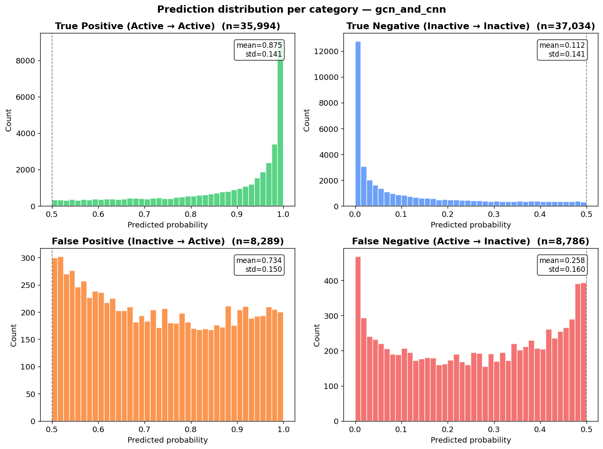
<figcaption><code>gcn_and_cnn</code></figcaption>
</figure>
<figure>
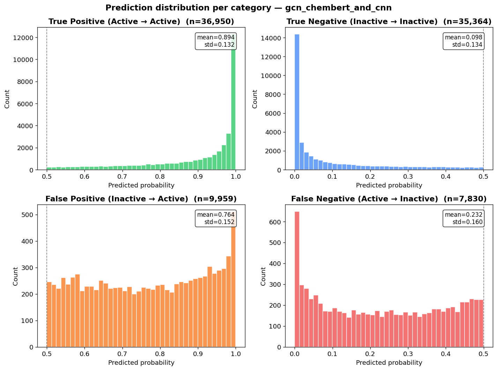
<figcaption><code>gcn_chembert_and_cnn</code></figcaption>
</figure>
<figcaption>Prediction probability distributions separated by category
(TP, TN, FP, FN) for the baseline and cross-attention
models.</figcaption>
</figure>

Visual diagnostics of the probability distributions (Figure
[4.6](#fig:prob_distribution){reference-type="ref"
reference="fig:prob_distribution"}) reveal a significant shift in the
decision-making strategy induced by the Cross-Attention mechanism. The
Phase 2 architecture (`gcn_chembert_and_cnn`) became noticeably more
aggressive in predicting active interactions. It successfully identified
nearly 1,000 more True Positives (36,950 compared to the baseline's
35,994) and visibly reduced the number of missed interactions, with
False Negatives dropping from 8,786 to 7,830. In a practical drug
discovery scenario, this indicates that the cross-attention model
achieves a higher Recall, identifying more potential therapeutic
candidates.

However, this increased sensitivity came at a cost to overall Precision.
The number of False Positives surged from 8,289 in Phase 1 to 9,959 in
Phase 2. More critically, the False Positive distribution for the Phase
2 model displays a spike at the extreme right edge of the plot
(probability close to 1.0). The mean predicted probability for these
false alarms increased from 0.734 to 0.764. This pattern highlights a
vulnerability: the Cross-Attention model suffers from overconfidence.
The additional contextual features from ChemBERTa appear to have
introduced noise that led the attention mechanism to confidently
misclassify thousands of inactive pairs. In contrast, the MLP fusion
utilized in Phase 1 proved to be more stable and resistant to such
confident failures.

### Class Separation and Learned Chemical Representations

<figure id="fig:feature_distributions" data-latex-placement="htbp">
<figure>
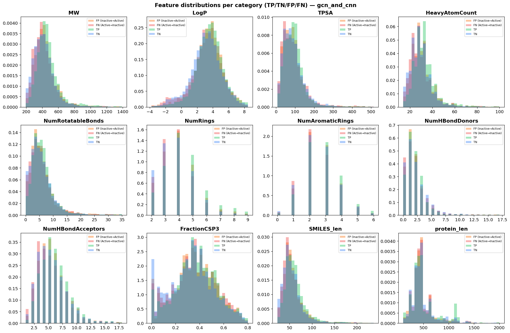
<figcaption><code>gcn_and_cnn</code></figcaption>
</figure>
<figure>
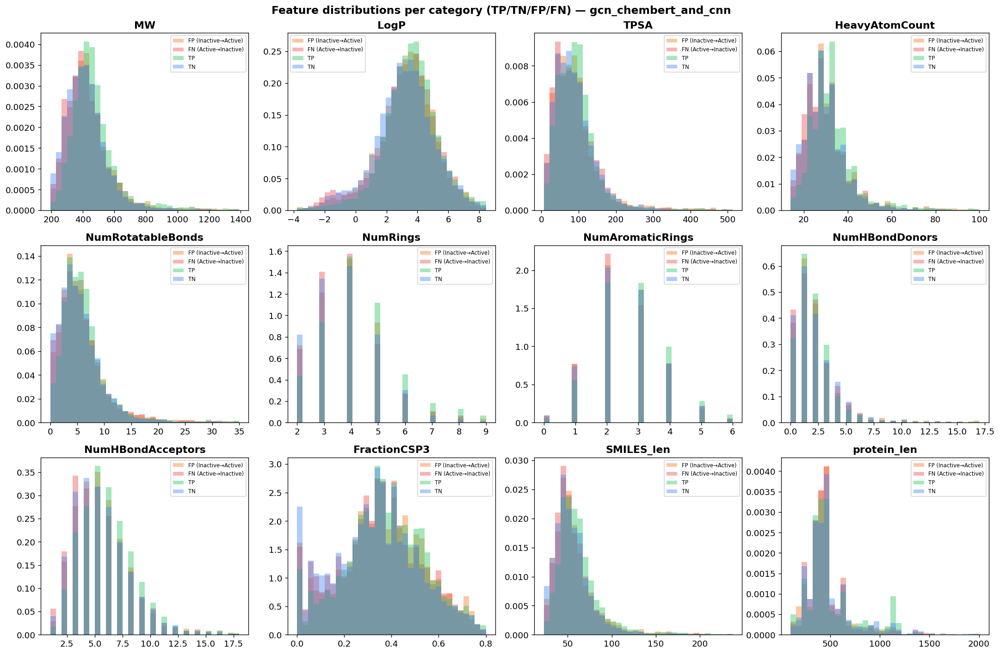
<figcaption><code>gcn_chembert_and_cnn</code></figcaption>
</figure>
<figcaption>Molecular feature distributions per prediction category (TP,
TN, FP, FN) highlighting class separation and structural
limitations.</figcaption>
</figure>

Detailed feature distribution plots (Figure
[4.7](#fig:feature_distributions){reference-type="ref"
reference="fig:feature_distributions"}) confirm that both models
successfully captured the genuine physicochemical differences between
active and inactive compounds. When comparing the distributions of True
Positives (green bars) and True Negatives (blue bars), a clear
divergence is visible. For metrics such as Molecular Weight (`MW`) and
Heavy Atom Count (`HeavyAtomCount`), the True Positive distributions are
consistently shifted to the right. Furthermore, for chemical complexity
metrics like the number of rings (`NumRings`), the True Negative class
dominates at lower values (0-2 rings), whereas the True Positive class
strongly peaks at higher values (3-5 rings), which is consistent with
the observation from §3.3.8 that active compounds tend to be
structurally more complex. A common risk in such imbalanced feature
distributions is shortcut learning, where the model might simply equate
larger molecular size with activity. However, comparing the
distributions of True Positives versus False Positives confirms that
this is not the case. The model successfully avoids this heuristic: it
correctly identifies large inactive molecules as True Negatives (visible
at 3-4 rings) rather than misclassifying them as False Positives. This
proves that the networks did not merely memorize a size-related bias,
but genuinely learned deep biochemical principles differentiating active
targets from decoys.

### Dominance of the GCN Encoder and Structural Bottlenecks

Initial hypotheses suggested that integrating the ChemBERTa language
model might mitigate the baseline's struggles with exceptionally large
or highly flexible molecules. However, the comparative feature
distributions reveal that the geometric constraints of the Graph
Convolutional Network remain the dominant factor in generating errors.

For features such as molecular weight, count of heavy atoms, and the
number of rotatable bonds, the shapes and locations of the error
distributions remain nearly identical across both architectures. Both
models exhibit noticeable right-tail error distributions for these
metrics. This visually confirms that the GCN struggles to effectively
propagate interaction signals across very extensive or highly flexible
molecular graphs. While the cross-attention mechanism altered the global
decision boundary, it did not fundamentally repair the geometric
signal-propagation bottlenecks inherent to the GCN itself.

### Aromaticity Bias

When analyzing the number of aromatic rings, both models exhibit a
shared pattern. The architectures demonstrate significantly higher
accuracy when evaluating complex molecules containing 3 or more aromatic
rings, heavily dominated by True Positives. Conversely, simpler
molecules with 0 to 2 rings generate a disproportionately high ratio of
false predictions. As noted in §3.3.8, active compounds in the dataset
tend to contain more aromatic rings than inactive ones, so the models
may be exploiting this correlation rather than learning a deeper
structural principle. This indicates that the models perform well on
rigid, drug-like compounds, but frequently fail to capture sufficient
distinguishing features in smaller, simpler chemical structures.

### Protein Length Resilience

In contrast to the ligand-side vulnerabilities, the distribution of
errors related to the protein sequence length closely follows the
distribution of correct predictions across both architectures. The
overlaid density plots show no significant deviation regardless of the
fusion strategy applied. This provides empirical evidence that the local
1D-CNN protein encoder is robust against variations in target size. It
further supports the intuition that drug-target affinity is primarily
governed by highly localized sequence motifs and specific binding
pockets, rather than by the global length of the protein chain.

## Phase 3: Integrating Domain Knowledge with LINCS L1000

Integrating the LINCS L1000 dataset as an additional modality yielded
improvements in overall predictive performance. As detailed in Table
[\[tab:lincs_fusion_comparison\]](#tab:lincs_fusion_comparison){reference-type="ref"
reference="tab:lincs_fusion_comparison"}, appending gene expression
features increased the Area Under the Curve (AUC) for all baseline
structural configurations, with the exception of the standalone GCN
model.

Excluding the single GCN setup, the remaining multimodal architectures
gained a minimum of 0.5 percentage points in AUC. The largest increase
occurred in the dual FP and ChemBERTa baseline, which improved by 5.1
percentage points (from 0.712 to 0.763) upon the addition of the LINCS
MLP module. This shift suggests that supplementing structural chemical
descriptors with functional transcriptomic data improves the
identification of complex interaction patterns.

Interestingly, the standalone GCN was the only model to suffer a
performance degradation when combined with LINCS. This drop likely
occurs because the highly dense, 978-dimensional biological vector
overwhelms the sparser topological signals extracted by the isolated GCN
during the late-fusion concatenation. Notably, when the GCN is supported
by an additional structural modality (e.g., FP + GCN), the integration
of LINCS successfully improves predictive performance.

Furthermore, the evaluation indicates a slight advantage for the global
Multi-Layer Perceptron (MLP) encoder over the dynamic graph variant
within the fusion frameworks. The standard MLP configuration yielded
higher AUC scores in 4 out of 7 evaluated structural combinations,
suggesting that a global functional summary is often sufficient for this
classification task.

To further isolate the predictive capacity of the biological
descriptors, the LINCS encoders were also evaluated independently,
without any structural features. Table
[4.2](#tab:lincs_only_models){reference-type="ref"
reference="tab:lincs_only_models"} presents the performance of these
transcriptomic-only models. While they achieve baseline predictive
capabilities (AUC near 0.698), they fall short of the structural
baselines, indicating that biological domain knowledge acts best as a
supplementary prior rather than a standalone descriptor.

::: {#tab:lincs_only_models}
  **Model Strategy**     **AUC**    **AUPRC**    **F1**     **Precision**   **Recall**
  -------------------- ----------- ----------- ----------- --------------- ------------
  LINCS (MLP)             0.697       0.616       0.595         0.583         0.606
  LINCS (Graph)         **0.698**   **0.617**   **0.601**     **0.594**     **0.608**

  : Performance of Models Using Exclusively LINCS L1000 Expression
  Profiles
:::

# Summary and Conclusions

[^1]: <https://www.bindingdb.org/rwd/bind/index.jsp>

[^2]: <https://ogb.stanford.edu/docs/home/>

[^3]: <https://scikit-fingerprints.readthedocs.io/latest/>