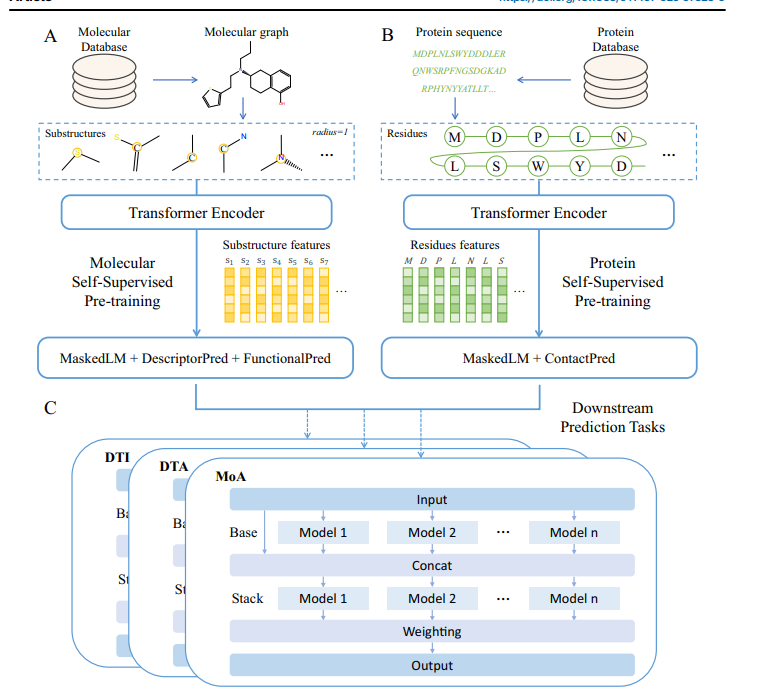

1. Zastosowanie **self-supervised pre-training** do wyciągniecia substruktur i kontekstowych informacji
2. Głownie rozwiązuje problem zimnego startu (brak wystarczających danych wejściowych, żeby uzyskać znaczący wynik)
3. Robi binarna predykcje DTI, ale też siłe powiązania (affirmation) i kierunek (aktywuje lub hamuje) 
4. Problemy z podstaowywmi modelami (cnn, lstm, transformers):
    - interpretowalność modeli
    - wymagają dużych i  czystych zbiorów danych co wymaga ręcznego etykietownia, co jest czasochłonne
    - słabo uogólniają (coś podobnego do cold startu w systemach rekomendacyjnych)
    - modele mają kłopot z przewidywaniem interkacji (MoA- mechanism of action), czyli aktywatora lub inhubatora
5. Działanie DTIAM
    - model potrzebuje tylko nieoznakowanego zbioru danych zaierającego leki i targety, wymaga jedynie grafu molekularnego związkow leków
    i początkowych sekwencji białek jako wejście do trenowania.
    - ekstraktuje  ubstruktury i kontekstowe informacje co poprawia zdolność do generalizacji
6. Architektura

    - model A zamienia SMILES na molekularne grafy, wyciąga z nich pojedyncze wiązania/strktury, a następnie jest "multi-task self-supervised
learning" do wyciągania cech
    - Transformer attention maps do wyciągania cech białek pojedynczych cząstek w łancuchu
    - potrójny moduł do predykcji  DTI, DTA, MoA
7. .Masked Language Modeling, Molecular Descriptor Prediction, and Molecular Functional Group Prediction - transformery 
8. MaskedLM + ContactPred - transformery
8. BERMol -  Bidirectional Encoder Representations of Molecular
- pretrained GuacaMol
- substruktury są traktowane jako słowa, a molekuły jako zdania. Substruktury trafiaja do multi-head self attetion.
- Do nauki wysokiej jakości reprezentacji molekularnych:
    - Masked Language Modeling: Losowe maskowanie części tokenów (podstruktur) i przewidywanie ich prawdziwej tożsamości.
    - Molecular Descriptor Prediction: Przewidywanie zbioru deskryptorów o wartościach rzeczywistych (właściwości fizykochemiczne) dla całej cząsteczki  
    - Molecular Functional Group Prediction: Przewidywanie grup funkcyjnych znajdujących się w cząsteczce.

Uczenie białek:
- Wstępne szkolenie ESM-2

Zebranie:
AutoGluon ( framework AutoML )