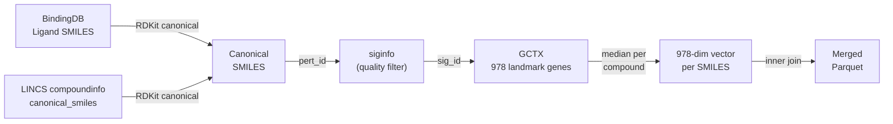

# LINCS L1000 × BindingDB – Merge Summary

## Pipeline Overview

Created [prepare_lincs.py](file:///home/kappy/Repos/Multimodal-models-for-predicting-drug-target-interactions/src/prepare_lincs.py) that merges LINCS L1000 gene expression profiles with the cleaned BindingDB DTI dataset.

### Matching Strategy



## Results

| Metric | Value |
|---|---|
| **Original DTI pairs** | 451,858 |
| **Matched DTI pairs** | 9,151 |
| **Coverage** | 2.0% |
| **Unique SMILES** | 1,360 |
| **Unique proteins** | 1,322 |
| **Active (pKi ≥ 7)** | 2,997 (32.7%) |
| **Inactive** | 6,154 (67.3%) |
| **Gene expression dims** | 978 (landmark genes) |
| **Output shape** | (9,151 × 984) |

## Data Quality

| Stat | Value |
|---|---|
| GE mean | 0.0005 |
| GE std | 0.708 |
| GE range | [-10.0, 10.0] |
| NaN values | **None** ✓ |

## Output File

```
src/datasets/clean_with_lincs.parquet
```

### Columns
- `Ligand SMILES` – original SMILES from BindingDB
- `Full_Protein_Sequence` – protein target sequence
- `Ki (nM)`, `pKi`, `is_active` – binding affinity labels
- `canon_smiles` – RDKit canonical SMILES (join key)
- `ge_AARS`, `ge_ABL1`, ..., `ge_DIPK1A` – **978 landmark gene expression features**

## Quality Filters Applied to LINCS

1. Only `trt_cp` (compound treatment) signatures
2. `is_hiq == 1` (high quality)
3. `qc_pass == 1` (QC passed)
4. `is_exemplar_sig == 1` (exemplar signatures only)
5. **7,507** exemplar signatures → aggregated via **median** per compound

## Key Observations

> [!NOTE]
> The 2% coverage is expected – BindingDB has 236k unique compounds while LINCS L1000 covers ~28k. The overlap of **1,686 SMILES** (after canonicalisation) yielded **1,292 compounds** with actual gene expression profiles in the GCTX file (some pert_ids may have been filtered out by quality criteria).

> [!TIP]
> The merged dataset is well-suited as an additional modality for your multimodal DTI models. The 978-dim gene expression vector can be fed through an MLP encoder or directly concatenated with other drug representations.
